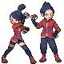
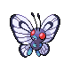

# Route 47 — Trainer Rosters

### Generic Trainers

| Trainer | P1 | P2 | P3 | P4 | P5 | P6 |
|:-------:|:--:|:--:|:--:|:--:|:--:|:--:|
|  Team Rocket Grunt |  [Rhyhorn](../../pokemon/rhyhorn.md/) Lv. 34 |  [Ariados](../../pokemon/ariados.md/) Lv. 34 |  [Lickilicky](../../pokemon/lickilicky.md/) Lv. 34 |
|  Team Rocket Grunt |  [Drowzee](../../pokemon/drowzee.md/) Lv. 34 |  [Swalot](../../pokemon/swalot.md/) Lv. 34 |  [Sharpedo](../../pokemon/sharpedo.md/) Lv. 34 |
|  Team Rocket Grunt |  [Murkrow](../../pokemon/murkrow.md/) Lv. 35 |  [Nidoqueen](../../pokemon/nidoqueen.md/) Lv. 35 |  [Nuzleaf](../../pokemon/nuzleaf.md/) Lv. 35 |
|  Team Rocket Grunt |  [Gloom](../../pokemon/gloom.md/) Lv. 35 |  [Loudred](../../pokemon/loudred.md/) Lv. 35 |  [Octillery](../../pokemon/octillery.md/) Lv. 35 |
|  Team Rocket Grunt |  [Houndour](../../pokemon/houndour.md/) Lv. 35 |  [Gligar](../../pokemon/gligar.md/) Lv. 35 |  [Persian](../../pokemon/persian.md/) Lv. 35 |
|  Team Rocket Grunt |  [Snover](../../pokemon/snover.md/) Lv. 35 |  [Vibrava](../../pokemon/vibrava.md/) Lv. 35 |  [Fearow](../../pokemon/fearow.md/) Lv. 35 |
|  Team Rocket Grunt |  [Noctowl](../../pokemon/noctowl.md/) Lv. 36 |  [Graveler](../../pokemon/graveler.md/) Lv. 36 |  [Magneton](../../pokemon/magneton.md/) Lv. 36 |
|  Team Rocket Grunt |  [Electrode](../../pokemon/electrode.md/) Lv. 36 |  [Venomoth](../../pokemon/venomoth.md/) Lv. 36 |  [Misdreavus](../../pokemon/misdreavus.md/) Lv. 36 |
|  Hiker Devin |  [Nosepass](../../pokemon/nosepass.md/) Lv. 36 |  [Probopass](../../pokemon/probopass.md/) Lv. 38 |
|  Camper Grant |  [Sandslash](../../pokemon/sandslash.md/) Lv. 37 |  [Dugtrio](../../pokemon/dugtrio.md/) Lv. 37 |  [Jumpluff](../../pokemon/jumpluff.md/) Lv. 37 |
|  Double Team Thom & Kae |  [Magmortar](../../pokemon/magmortar.md/) Lv. 38 |  [Electivire](../../pokemon/electivire.md/) Lv. 38 |
|  Young Couple Duff & Eda |  [Cloyster](../../pokemon/cloyster.md/) Lv. 37 |  [Butterfree](../../pokemon/butterfree.md/) Lv. 37 |
|  PKMN Trainer Mira |  [Porygon2](../../pokemon/porygon2.md/) Lv. 35 |  [Togetic](../../pokemon/togetic.md/) Lv. 35 |  [Alakazam](../../pokemon/alakazam.md/) Lv. 35 |
|  PKMN Trainer Buck |  [Umbreon](../../pokemon/umbreon.md/) Lv. 35 |  [Torkoal](../../pokemon/torkoal.md/) Lv. 35 |  [Claydol](../../pokemon/claydol.md/) Lv. 36 |
|  PKMN Trainer Cheryl |  [Drifblim](../../pokemon/drifblim.md/) Lv. 35 |  [Wobbuffet](../../pokemon/wobbuffet.md/) Lv. 35 |  [Blissey](../../pokemon/blissey.md/) Lv. 35 |
|  PKMN Trainer Marley |  [Sneasel](../../pokemon/sneasel.md/) Lv. 35 |  [Ninjask](../../pokemon/ninjask.md/) Lv. 35 |  [Arcanine](../../pokemon/arcanine.md/) Lv. 36 |

### Important Trainers

1. [Executive Ariana](important_trainers.md#executive-ariana)
