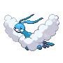

# Route 47 — Wild Pokémon

### Grass, Morning / Day*

| Sprite | Pokémon | Encounter Type | Level | Chance |
|:------:|---------|:--------------:|-------|--------|
### Day*

| Sprite | Pokémon | Encounter Type | Level | Chance |
|:------:|---------|:--------------:|-------|--------|
|  | [Farfetch’d](../../pokemon/farfetchd.md) | {: style="max-width: 24px;"" }| 41 – 45 | 20% |
|  | [Ditto](../../pokemon/ditto.md) | {: style="max-width: 24px;"" }| 41 – 45 | 20% |
|  | [Miltank](../../pokemon/miltank.md) | {: style="max-width: 24px;"" }| 41 – 45 | 10% |
|  | [Gloom](../../pokemon/gloom.md) | {: style="max-width: 24px;"" }| 41 – 45 | 10% |
|  | [Weepinbell](../../pokemon/weepinbell.md) | {: style="max-width: 24px;"" }| 41 – 45 | 10% |
|  | [Fearow](../../pokemon/fearow.md) | {: style="max-width: 24px;"" }| 41 – 45 | 10% |
|  | [Raticate](../../pokemon/raticate.md) | {: style="max-width: 24px;"" }| 41 – 45 | 10% |
|  | [Swellow](../../pokemon/swellow.md) | {: style="max-width: 24px;"" }| 41 – 45 | 10% |

### Grass, Night*

| Sprite | Pokémon | Encounter Type | Level | Chance |
|:------:|---------|:--------------:|-------|--------|
|  | [Venomoth](../../pokemon/venomoth.md) | {: style="max-width: 24px;"" } {: style="max-width: 24px;"" }| 41 – 45 | 20% |
|  | [Ditto](../../pokemon/ditto.md) | {: style="max-width: 24px;"" } {: style="max-width: 24px;"" }| 41 – 45 | 20% |
|  | [Miltank](../../pokemon/miltank.md) | {: style="max-width: 24px;"" } {: style="max-width: 24px;"" }| 41 – 45 | 10% |
|  | [Gloom](../../pokemon/gloom.md) | {: style="max-width: 24px;"" } {: style="max-width: 24px;"" }| 41 – 45 | 10% |
|  | [Weepinbell](../../pokemon/weepinbell.md) | {: style="max-width: 24px;"" } {: style="max-width: 24px;"" }| 41 – 45 | 10% |
|  | [Fearow](../../pokemon/fearow.md) | {: style="max-width: 24px;"" } {: style="max-width: 24px;"" }| 41 – 45 | 10% |
|  | [Raticate](../../pokemon/raticate.md) | {: style="max-width: 24px;"" } {: style="max-width: 24px;"" }| 41 – 45 | 10% |
|  | [Noctowl](../../pokemon/noctowl.md) | {: style="max-width: 24px;"" } {: style="max-width: 24px;"" }| 41 – 45 | 10% |

### Meridian Sound

| Sprite | Pokémon | Encounter Type | Level | Chance |
|:------:|---------|:--------------:|-------|--------|
|  | [Bellossom](../../pokemon/bellossom.md) | {: style="max-width: 24px;"" }| 41 – 45 | 50% |
|  | [Victreebel](../../pokemon/victreebel.md) | {: style="max-width: 24px;"" }| 41 – 45 | 50% |

### Pastoral Sound

| Sprite | Pokémon | Encounter Type | Level | Chance |
|:------:|---------|:--------------:|-------|--------|
|  | [Yanma](../../pokemon/yanma.md) | {: style="max-width: 24px;"" }| 41 – 45 | 100% |

### Swarm

| Sprite | Pokémon | Encounter Type | Level | Chance |
|:------:|---------|:--------------:|-------|--------|
|  | [Altaria](../../pokemon/altaria.md) | {: style="max-width: 24px;"" }| 41 – 45 | 100% |

### Surf

| Sprite | Pokémon | Encounter Type | Level | Chance |
|:------:|---------|:--------------:|-------|--------|
|  | [Wingull](../../pokemon/wingull.md) | {: style="max-width: 24px;"" }| 41 – 45 | 60% |
|  | [Seel](../../pokemon/seel.md) | {: style="max-width: 24px;"" }| 41 – 45 | 30% |
|  | [Spheal](../../pokemon/spheal.md) | {: style="max-width: 24px;"" }| 41 – 45 | 10% |

### Old Rod

| Sprite | Pokémon | Encounter Type | Level | Chance |
|:------:|---------|:--------------:|-------|--------|
|  | [Magikarp](../../pokemon/magikarp.md) | {: style="max-width: 24px;"" }| 10 | 90% |
|  | [Tentacool](../../pokemon/tentacool.md) | {: style="max-width: 24px;"" }| 10 | 10% |

### Good Rod

| Sprite | Pokémon | Encounter Type | Level | Chance |
|:------:|---------|:--------------:|-------|--------|
|  | [Tentacool](../../pokemon/tentacool.md) | {: style="max-width: 24px;"" }| 25 | 60% |
|  | [Shellder](../../pokemon/shellder.md) | {: style="max-width: 24px;"" }| 25 | 30% |
|  | [Chinchou](../../pokemon/chinchou.md) | {: style="max-width: 24px;"" }| 25 | 10% |

### Super Rod

| Sprite | Pokémon | Encounter Type | Level | Chance |
|:------:|---------|:--------------:|-------|--------|
|  | [Shellder](../../pokemon/shellder.md) | {: style="max-width: 24px;"" }| 50 | 60% |
|  | [Tentacool](../../pokemon/tentacool.md) | {: style="max-width: 24px;"" }| 50 | 30% |
|  | [Tentacruel](../../pokemon/tentacruel.md) | {: style="max-width: 24px;"" }| 50 | 7% |
|  | [Lanturn](../../pokemon/lanturn.md) | {: style="max-width: 24px;"" }| 50 | 3% |

