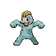

# Route 5 — Wild Pokémon

### Grass, Morning / Day

| Sprite | Pokémon | Encounter Type | Level | Chance |
|:------:|---------|:--------------:|-------|--------|
|  | Pidgeotto | {: style="max-width: 24px;"" } {: style="max-width: 24px;"" } {: style="max-width: 24px;"" } | 47 – 50 | 20% |
|  | Raticate | {: style="max-width: 24px;"" } {: style="max-width: 24px;"" } {: style="max-width: 24px;"" } | 47 – 50 | 20% |
|  | Kadabara | {: style="max-width: 24px;"" } {: style="max-width: 24px;"" } {: style="max-width: 24px;"" } | 47 – 50 | 10% |
|  | Jigglypuff | {: style="max-width: 24px;"" } {: style="max-width: 24px;"" } {: style="max-width: 24px;"" } | 47 – 50 | 10% |
|  | Machop | {: style="max-width: 24px;"" } {: style="max-width: 24px;"" } {: style="max-width: 24px;"" } | 47 – 50 | 10% |
|  | Weepinbell | {: style="max-width: 24px;"" } {: style="max-width: 24px;"" } {: style="max-width: 24px;"" } | 47 – 50 | 10% |
|  | Meditite | {: style="max-width: 24px;"" } {: style="max-width: 24px;"" } {: style="max-width: 24px;"" } | 47 – 50 | 10% |
|  | Chatot | {: style="max-width: 24px;"" } {: style="max-width: 24px;"" } {: style="max-width: 24px;"" } | 47 – 50 | 10% |

### Grass, Night

| Sprite | Pokémon | Encounter Type | Level | Chance |
|:------:|---------|:--------------:|-------|--------|
|  | Mightyena | {: style="max-width: 24px;"" } {: style="max-width: 24px;"" } | 47 – 50 | 20% |
|  | Raticate | {: style="max-width: 24px;"" } {: style="max-width: 24px;"" } | 47 – 50 | 20% |
|  | Kadabara | {: style="max-width: 24px;"" } {: style="max-width: 24px;"" } | 47 – 50 | 10% |
|  | Jigglypuff | {: style="max-width: 24px;"" } {: style="max-width: 24px;"" } | 47 – 50 | 10% |
|  | Machop | {: style="max-width: 24px;"" } {: style="max-width: 24px;"" } | 47 – 50 | 10% |
|  | Weepinbell | {: style="max-width: 24px;"" } {: style="max-width: 24px;"" } | 47 – 50 | 10% |
|  | Meditite | {: style="max-width: 24px;"" } {: style="max-width: 24px;"" } | 47 – 50 | 10% |
|  | Persian | {: style="max-width: 24px;"" } {: style="max-width: 24px;"" } | 47 – 50 | 10% |

### Meridian Sound

| Sprite | Pokémon | Encounter Type | Level | Chance |
|:------:|---------|:--------------:|-------|--------|
|  | Medicham | {: style="max-width: 24px;"" } | 47 – 50 | 100% |

### Pastoral Sound

| Sprite | Pokémon | Encounter Type | Level | Chance |
|:------:|---------|:--------------:|-------|--------|
|  | Staravia | {: style="max-width: 24px;"" } | 47 – 50 | 50% |
|  | Swellow | {: style="max-width: 24px;"" } | 47 – 50 | 50% |

