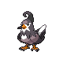
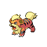

# Route 7 — Wild Pokémon

### Grass, Morning / Day

| Sprite | Pokémon | Encounter Type | Level | Chance |
|:------:|---------|:--------------:|-------|--------|
|  | Weepinbell | {: style="max-width: 24px;"" } {: style="max-width: 24px;"" } {: style="max-width: 24px;"" } | 50 – 54 | 20% |
|  | Pidgeotto | {: style="max-width: 24px;"" } {: style="max-width: 24px;"" } {: style="max-width: 24px;"" } | 50 – 54 | 20% |
|  | Staravia | {: style="max-width: 24px;"" } {: style="max-width: 24px;"" } {: style="max-width: 24px;"" } | 50 – 54 | 15% |
|  | Growlithe | {: style="max-width: 24px;"" } {: style="max-width: 24px;"" } {: style="max-width: 24px;"" } | 50 – 54 | 10% |
|  | Vulpix | {: style="max-width: 24px;"" } {: style="max-width: 24px;"" } {: style="max-width: 24px;"" } | 50 – 54 | 10% |
|  | Jigglypuff | {: style="max-width: 24px;"" } {: style="max-width: 24px;"" } {: style="max-width: 24px;"" } | 50 – 54 | 10% |
|  | Raticate | {: style="max-width: 24px;"" } {: style="max-width: 24px;"" } {: style="max-width: 24px;"" } | 50 – 54 | 10% |
|  | Kadabra | {: style="max-width: 24px;"" } {: style="max-width: 24px;"" } {: style="max-width: 24px;"" } | 50 – 54 | 5% |

### Grass, Night

| Sprite | Pokémon | Encounter Type | Level | Chance |
|:------:|---------|:--------------:|-------|--------|
|  | Weepinbell | {: style="max-width: 24px;"" } {: style="max-width: 24px;"" } | 50 – 54 | 20% |
|  | Gloom | {: style="max-width: 24px;"" } {: style="max-width: 24px;"" } | 50 – 54 | 20% |
|  | Houndour | {: style="max-width: 24px;"" } {: style="max-width: 24px;"" } | 50 – 54 | 15% |
|  | Growlithe | {: style="max-width: 24px;"" } {: style="max-width: 24px;"" } | 50 – 54 | 10% |
|  | Vulpix | {: style="max-width: 24px;"" } {: style="max-width: 24px;"" } | 50 – 54 | 10% |
|  | Jigglypuff | {: style="max-width: 24px;"" } {: style="max-width: 24px;"" } | 50 – 54 | 10% |
|  | Persian | {: style="max-width: 24px;"" } {: style="max-width: 24px;"" } | 50 – 54 | 10% |
|  | Houndoom | {: style="max-width: 24px;"" } {: style="max-width: 24px;"" } | 50 – 54 | 5% |

### Meridian Sound

| Sprite | Pokémon | Encounter Type | Level | Chance |
|:------:|---------|:--------------:|-------|--------|
|  | Bellossom | {: style="max-width: 24px;"" } | 50 – 54 | 100% |

### Pastoral Sound

| Sprite | Pokémon | Encounter Type | Level | Chance |
|:------:|---------|:--------------:|-------|--------|
|  | Linoone | {: style="max-width: 24px;"" } | 50 – 54 | 50% |
|  | Bibarel | {: style="max-width: 24px;"" } | 50 – 54 | 50% |

