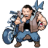

# Route 8 — Trainer Rosters

### Generic Trainers

| Trainer | P1 | P2 | P3 | P4 | P5 | P6 |
|:-------:|:--:|:--:|:--:|:--:|:--:|:--:|
|  Gentleman Milton |  [Ninetales](../../pokemon/ninetales.md/) Lv. 60 |
|  Super Nerd Tyrone |  [Magneton](../../pokemon/magneton.md/) Lv. 58 |  [Victreebel](../../pokemon/victreebel.md/) Lv. 58 |  [Electrode](../../pokemon/electrode.md/) Lv. 58 |
|  Young Couple Moe & Lulu |  [Shiftry](../../pokemon/shiftry.md/) Lv. 58 |  [Ludicolo](../../pokemon/ludicolo.md/) Lv. 58 |
|  Super Nerd Sam |  [Skuntank](../../pokemon/skuntank.md/) Lv. 58 |  [Muk](../../pokemon/muk.md/) Lv. 60 |
|  Biker Zeke |  [Pinsir](../../pokemon/pinsir.md/) Lv. 58 |  [Scizor](../../pokemon/scizor.md/) Lv. 58 |
|  Biker Harris |  [Flareon](../../pokemon/flareon.md/) Lv. 60 |
|  Biker Dwayne |  [Weezing](../../pokemon/weezing.md/) Lv. 57 |  [Muk](../../pokemon/muk.md/) Lv. 57 |  [Arbok](../../pokemon/arbok.md/) Lv. 57 |  [Swalot](../../pokemon/swalot.md/) Lv. 57 |

