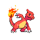

# Route 9 — Trainer Rosters

### Generic Trainers

| Trainer | P1 | P2 | P3 | P4 | P5 | P6 |
|:-------:|:--:|:--:|:--:|:--:|:--:|:--:|
|  Picnicker Edna |  Cherrim Lv. 58 |  Chansey Lv. 58 |  Manectric Lv. 58 |
|  Camper Sid |  Golbat Lv. 57 |  Umbreon Lv. 57 |  Primeape Lv. 57 |
|  Camper Dean |  Golduck Lv. 58 |  Charmeleon Lv. 58 |  Venomoth Lv. 58 |
|  Hiker Eoin |  Magneton Lv. 58 |  Graveler Lv. 58 |  Hariyama Lv. 58 |
|  Picnicker Heidi |  Jumpluff Lv. 58 |  Delcatty Lv. 58 |
|  Hiker Clarke |  Sudowoodo Lv. 59 |  Dugtrio Lv. 59 |

