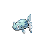

# Ruins of Alph — Wild Pokémon

### Grass

| Sprite | Pokémon | Encounter Type | Level | Chance |
|:------:|---------|:--------------:|-------|--------|
|  | Natu | {: style="max-width: 24px;"" } | 26 – 30 | 40% |
|  | Smeargle | {: style="max-width: 24px;"" } | 26 – 30 | 40% |
|  | Girafarig | {: style="max-width: 24px;"" } | 26 – 30 | 20% |

### Rock Smash

| Sprite | Pokémon | Encounter Type | Level | Chance |
|:------:|---------|:--------------:|-------|--------|
|  | Geodude | {: style="max-width: 24px;"" } | 26 – 30 | 90% |
|  | Nosepass | {: style="max-width: 24px;"" } | 26 – 30 | 10% |

### Meridian Sound

| Sprite | Pokémon | Encounter Type | Level | Chance |
|:------:|---------|:--------------:|-------|--------|
|  | Xatu | {: style="max-width: 24px;"" } | 26 – 30 | 100% |

### Pastoral Sound

| Sprite | Pokémon | Encounter Type | Level | Chance |
|:------:|---------|:--------------:|-------|--------|
|  | Togepi | {: style="max-width: 24px;"" } | 26 – 30 | 100% |

### Surf

| Sprite | Pokémon | Encounter Type | Level | Chance |
|:------:|---------|:--------------:|-------|--------|
|  | Wooper | {: style="max-width: 24px;"" } | 26 – 30 | 90% |
|  | Quagsire | {: style="max-width: 24px;"" } | 26 – 30 | 10% |

### Old Rod

| Sprite | Pokémon | Encounter Type | Level | Chance |
|:------:|---------|:--------------:|-------|--------|
|  | Magikarp | {: style="max-width: 24px;"" } | 10 | 60% |
|  | Remoraid | {: style="max-width: 24px;"" } | 10 | 30% |
|  | Dratini | {: style="max-width: 24px;"" } | 10 | 10% |

### Good Rod

| Sprite | Pokémon | Encounter Type | Level | Chance |
|:------:|---------|:--------------:|-------|--------|
|  | Magikarp | {: style="max-width: 24px;"" } | 25 | 60% |
|  | Remoraid | {: style="max-width: 24px;"" } | 25 | 30% |
|  | Dratini | {: style="max-width: 24px;"" } | 25 | 9% |
|  | Dragonair | {: style="max-width: 24px;"" } | 25 | 1% |

### Super Rod

| Sprite | Pokémon | Encounter Type | Level | Chance |
|:------:|---------|:--------------:|-------|--------|
|  | Gyarados | {: style="max-width: 24px;"" } | 50 | 60% |
|  | Relicanth | {: style="max-width: 24px;"" } | 50 | 30% |
|  | Dragonair | {: style="max-width: 24px;"" } | 50 | 5% |
|  | Octillery | {: style="max-width: 24px;"" } | 50 | 5% |

