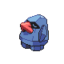

# Ruins of Alph — Wild Pokémon

### Grass

| Sprite | Pokémon | Encounter Type | Level | Chance |
|:------:|---------|:--------------:|-------|--------|
|  | [Natu](../../pokemon/natu.md) | encounter_sprites| 26 – 30 | 40% |
|  | [Smeargle](../../pokemon/smeargle.md) | encounter_sprites| 26 – 30 | 40% |
|  | [Girafarig](../../pokemon/girafarig.md) | encounter_sprites| 26 – 30 | 20% |

### Rock Smash

| Sprite | Pokémon | Encounter Type | Level | Chance |
|:------:|---------|:--------------:|-------|--------|
|  | [Geodude](../../pokemon/geodude.md) | encounter_sprites| 26 – 30 | 90% |
|  | [Nosepass](../../pokemon/nosepass.md) | encounter_sprites| 26 – 30 | 10% |

### Meridian Sound

| Sprite | Pokémon | Encounter Type | Level | Chance |
|:------:|---------|:--------------:|-------|--------|
|  | [Xatu](../../pokemon/xatu.md) | encounter_sprites| 26 – 30 | 100% |

### Pastoral Sound

| Sprite | Pokémon | Encounter Type | Level | Chance |
|:------:|---------|:--------------:|-------|--------|
|  | [Togepi](../../pokemon/togepi.md) | encounter_sprites| 26 – 30 | 100% |

### Surf

| Sprite | Pokémon | Encounter Type | Level | Chance |
|:------:|---------|:--------------:|-------|--------|
|  | [Wooper](../../pokemon/wooper.md) | encounter_sprites| 26 – 30 | 90% |
|  | [Quagsire](../../pokemon/quagsire.md) | encounter_sprites| 26 – 30 | 10% |

### Old Rod

| Sprite | Pokémon | Encounter Type | Level | Chance |
|:------:|---------|:--------------:|-------|--------|
|  | [Magikarp](../../pokemon/magikarp.md) | encounter_sprites| 10 | 60% |
|  | [Remoraid](../../pokemon/remoraid.md) | encounter_sprites| 10 | 30% |
|  | [Dratini](../../pokemon/dratini.md) | encounter_sprites| 10 | 10% |

### Good Rod

| Sprite | Pokémon | Encounter Type | Level | Chance |
|:------:|---------|:--------------:|-------|--------|
|  | [Magikarp](../../pokemon/magikarp.md) | encounter_sprites| 25 | 60% |
|  | [Remoraid](../../pokemon/remoraid.md) | encounter_sprites| 25 | 30% |
|  | [Dratini](../../pokemon/dratini.md) | encounter_sprites| 25 | 9% |
|  | [Dragonair](../../pokemon/dragonair.md) | encounter_sprites| 25 | 1% |

### Super Rod

| Sprite | Pokémon | Encounter Type | Level | Chance |
|:------:|---------|:--------------:|-------|--------|
|  | [Gyarados](../../pokemon/gyarados.md) | encounter_sprites| 50 | 60% |
|  | [Relicanth](../../pokemon/relicanth.md) | encounter_sprites| 50 | 30% |
|  | [Dragonair](../../pokemon/dragonair.md) | encounter_sprites| 50 | 5% |
|  | [Octillery](../../pokemon/octillery.md) | encounter_sprites| 50 | 5% |

