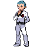

# Safari Zone Gate — Important Trainers

### Executive Archer

| Pokémon | Attributes | Item | Moves |
|:-------:|------------|:----:|-------|
| | **Lv. 38** [Zangoose](../../pokemon/zangoose.md/) **Ability:** Immunity  | None | 1. Crush Claw 2. Close Combat 3. X-Scissor 4. Detect |
| | **Lv. 38** [Gyarados](../../pokemon/gyarados.md/) **Ability:** Intimidate   | None | 1. Waterfall 2. Bounce 3. Ice Fang 4. Dragon Dance |
| | **Lv. 39** [Houndoom](../../pokemon/houndoom.md/) **Ability:** Intimidate   | None | 1. Fire Blast 2. Feint Attack 3. Will-O-Wisp 4. Thunder Fang |

