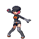
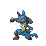
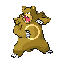

# Trainer Rosters

### Generic Trainers

| Trainer | P1 | P2 | P3 | P4 | P5 | P6 |
|:-------:|:--:|:--:|:--:|:--:|:--:|:--:|
|  Team Rocket Grunt |  [Scyther](../../pokemon/scyther.md/) Lv. 37 |  [Mawile](../../pokemon/mawile.md/) Lv. 37 |  [Granbull](../../pokemon/granbull.md/) Lv. 37 |
|  PKMN Trainer Riley |  [Absol](../../pokemon/absol.md/) Lv. 37 |  [Lucario](../../pokemon/lucario.md/) Lv. 37 |  [Ursaring](../../pokemon/ursaring.md/) Lv. 37 |

### Important Trainers

1. [Executive Archer](important_trainers.md#executive-archer)
