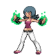
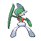
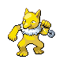

# Saffron City — Important Trainers

---

## Gym

### Leader Sabrina

| Pokémon | Attributes | Item | Moves |
|:-------:|------------|:----:|-------|
|  | **Lv. 63** Gallade **Ability:** Steadfast   | None | 1. Close Combat 2. Leaf Blade 3. Psycho Cut 4. Skill Swap |
|  | **Lv. 61** Hypno **Ability:** Insomnia  | None | 1. Nasty Plot 2. Psychic 3. Grass Knot 4. Baton Pass |
|  | **Lv. 62** Medicham **Ability:** Pure Power   | None | 1. High Jump Kick 2. Zen Headbutt 3. Fake Out 4. Bullet Punch |
|  | **Lv. 63** Mr. Mime **Ability:** Filter   | None | 1. Nasty Plot 2. Psychic 3. Thunderbolt 4. Focus Blast |
|  | **Lv. 63** Wobbuffet **Ability:** Shadow Tag  | None | 1. Encore 2. Counter 3. Mirror Coat 4. Safeguard |
|  | **Lv. 66** Alakazam **Ability:** Magic Guard  |  Sitrus Berry | 1. Psychic 2. Calm Mind 3. Focus Blast 4. Signal Beam |

