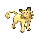

# Trainer Rosters

---

## Gym

### Generic Trainers

| Trainer | P1 | P2 | P3 | P4 | P5 | P6 |
|:-------:|:--:|:--:|:--:|:--:|:--:|:--:|
|  Medium Rebecca |  [Bronzong](../../pokemon/bronzong.md/) Lv. 62 |  [Claydol](../../pokemon/claydol.md/) Lv. 62 |  [Gardevoir](../../pokemon/gardevoir.md/) Lv. 62 |
|  Psychic Jared |  [Hypno](../../pokemon/hypno.md/) Lv. 63 |  [Girafarig](../../pokemon/girafarig.md/) Lv. 63 |  [Medicham](../../pokemon/medicham.md/) Lv. 63 |
|  Medium Darcy |  [Slowbro](../../pokemon/slowbro.md/) Lv. 62 |  [Mismagius](../../pokemon/mismagius.md/) Lv. 62 |  [Dusclops](../../pokemon/dusclops.md/) Lv. 62 |  [Mr. Mime](../../pokemon/mr-mime.md/) Lv. 62 |
|  Psychic Franklin |  [Metang](../../pokemon/metang.md/) Lv. 64 |  [Xatu](../../pokemon/xatu.md/) Lv. 64 |

### Important Trainers

1. [Leader Sabrina](important_trainers.md#leader-sabrina)

---

## Dojo

### Generic Trainers

| Trainer | P1 | P2 | P3 | P4 | P5 | P6 |
|:-------:|:--:|:--:|:--:|:--:|:--:|:--:|
| ") Leader Falkner (Sa4-9:59a) |  [Fearow](../../pokemon/fearow.md/) Lv. 68 |  [Pelipper](../../pokemon/pelipper.md/) Lv. 64 |  [Noctowl](../../pokemon/noctowl.md/) Lv. 66 |  [Swellow](../../pokemon/swellow.md/) Lv. 68 |  [Staraptor](../../pokemon/staraptor.md/) Lv. 70 |  [Pidgeot](../../pokemon/pidgeot.md/) Lv. 72 |
| ") Leader Bugsy (Th10a–7:59p) |  [Yanmega](../../pokemon/yanmega.md/) Lv. 70 |  [Heracross](../../pokemon/heracross.md/) Lv. 68 |  [Vespiquen](../../pokemon/vespiquen.md/) Lv. 68 |  [Pinsir](../../pokemon/pinsir.md/) Lv. 69 |  [Masquerain](../../pokemon/masquerain.md/) Lv. 70 |  [Scizor](../../pokemon/scizor.md/) Lv. 72 |
| ") Leader Whitney (Sa10a–7:59p) |  [Stantler](../../pokemon/stantler.md/) Lv. 71 |  [Blissey](../../pokemon/blissey.md/) Lv. 69 |  [Lopunny](../../pokemon/lopunny.md/) Lv. 69 |  [Togekiss](../../pokemon/togekiss.md/) Lv. 70 |  [Clefable](../../pokemon/clefable.md/) Lv. 72 |  [Miltank](../../pokemon/miltank.md/) Lv. 73 |
| ") Leader Morty (T8p-3:59a) |  [Drifblim](../../pokemon/drifblim.md/) Lv. 72 |  [Dusknoir](../../pokemon/dusknoir.md/) Lv. 68 |  [Banette](../../pokemon/banette.md/) Lv. 70 |  [Spiritomb](../../pokemon/spiritomb.md/) Lv. 70 |  [Mismagius](../../pokemon/mismagius.md/) Lv. 72 |  [Gengar](../../pokemon/gengar.md/) Lv. 74 |
| ") Leader Chuck (W8p-3:59a) |  [Hariyama](../../pokemon/hariyama.md/) Lv. 73 |  [Medicham](../../pokemon/medicham.md/) Lv. 70 |  [Breloom](../../pokemon/breloom.md/) Lv. 70 |  [Blaziken](../../pokemon/blaziken.md/) Lv. 72 |  [Primeape](../../pokemon/primeape.md/) Lv. 73 |  [Poliwrath](../../pokemon/poliwrath.md/) Lv. 75 |
| ") Leader Jasmine (W10a–7:59p) |  [Metagross](../../pokemon/metagross.md/) Lv. 72 |  [Empoleon](../../pokemon/empoleon.md/) Lv. 68 |  [Aggron](../../pokemon/aggron.md/) Lv. 68 |  [Skarmory](../../pokemon/skarmory.md/) Lv. 70 |  [Magnezone](../../pokemon/magnezone.md/) Lv. 74 |  [Steelix](../../pokemon/steelix.md/) Lv. 78 |
| ") Leader Pryce (M4-9:59a) |  [Abomasnow](../../pokemon/abomasnow.md/) Lv. 72 |  [Walrein](../../pokemon/walrein.md/) Lv. 70 |  [Cloyster](../../pokemon/cloyster.md/) Lv. 72 |  [Dewgong](../../pokemon/dewgong.md/) Lv. 74 |  [Lapras](../../pokemon/lapras.md/) Lv. 74 |  [Mamoswine](../../pokemon/mamoswine.md/) Lv. 76 |
| ") Leader Claire (F8p-3:59a) |  [Dragonair](../../pokemon/dragonair.md/) Lv. 72 |  [Aerodactyl](../../pokemon/aerodactyl.md/) Lv. 72 |  [Altaria](../../pokemon/altaria.md/) Lv. 74 |  [Gyarados](../../pokemon/gyarados.md/) Lv. 76 |  [Salamence](../../pokemon/salamence.md/) Lv. 76 |  [Kingdra](../../pokemon/kingdra.md/) Lv. 78 |
| ") Leader Brock (Sa8p-3:59a) |  [Rampardos](../../pokemon/rampardos.md/) Lv. 69 |  [Probopass](../../pokemon/probopass.md/) Lv. 66 |  [Sudowoodo](../../pokemon/sudowoodo.md/) Lv. 71 |  [Kabutops](../../pokemon/kabutops.md/) Lv. 71 |  [Omastar](../../pokemon/omastar.md/) Lv. 71 |  [Steelix](../../pokemon/steelix.md/) Lv. 73 |
| ") Leader Misty (W4-9:59a) |  [Politoed](../../pokemon/politoed.md/) Lv. 68 |  [Gorebyss](../../pokemon/gorebyss.md/) Lv. 68 |  [Lanturn](../../pokemon/lanturn.md/) Lv. 68 |  [Quagsire](../../pokemon/quagsire.md/) Lv. 68 |  [Milotic](../../pokemon/milotic.md/) Lv. 72 |  [Starmie](../../pokemon/starmie.md/) Lv. 72 |
| ") Leader Lt. Surge (F4-9:59a) |  [Electrode](../../pokemon/electrode.md/) Lv. 72 |  [Luxray](../../pokemon/luxray.md/) Lv. 70 |  [Manectric](../../pokemon/manectric.md/) Lv. 70 |  [Electivire](../../pokemon/electivire.md/) Lv. 72 |  [Magnezone](../../pokemon/magnezone.md/) Lv. 72 |  [Raichu](../../pokemon/raichu.md/) Lv. 74 |
| ") Leader Erika (Su4-9:59a) |  [Jumpluff](../../pokemon/jumpluff.md/) Lv. 73 |  [Roserade](../../pokemon/roserade.md/) Lv. 72 |  [Tropius](../../pokemon/tropius.md/) Lv. 73 |  [Bellossom](../../pokemon/bellossom.md/) Lv. 75 |  [Victreebel](../../pokemon/victreebel.md/) Lv. 75 |  [Tangrowth](../../pokemon/tangrowth.md/) Lv. 76 |
| ") Leader Janine (M10a–7:59p) |  [Toxicroak](../../pokemon/toxicroak.md/) Lv. 68 |  [Nidoqueen](../../pokemon/nidoqueen.md/) Lv. 66 |  [Tentacruel](../../pokemon/tentacruel.md/) Lv. 68 |  [Ariados](../../pokemon/ariados.md/) Lv. 70 |  [Drapion](../../pokemon/drapion.md/) Lv. 70 |  [Venomoth](../../pokemon/venomoth.md/) Lv. 72 |
| ") Leader Sabrina (S10a–7:59p) |  [Wobbuffet](../../pokemon/wobbuffet.md/) Lv. 72 |  [Jynx](../../pokemon/jynx.md/) Lv. 70 |  [Espeon](../../pokemon/espeon.md/) Lv. 70 |  [Gallade](../../pokemon/gallade.md/) Lv. 72 |  [Mr. Mime](../../pokemon/mr-mime.md/) Lv. 74 |  [Alakazam](../../pokemon/alakazam.md/) Lv. 76 |
| ") Leader Blaine (T10a–7:59p) |  [Ninetales](../../pokemon/ninetales.md/) Lv. 74 |  [Camerupt](../../pokemon/camerupt.md/) Lv. 72 |  [Torkoal](../../pokemon/torkoal.md/) Lv. 72 |  [Typhlosion](../../pokemon/typhlosion.md/) Lv. 76 |  [Rapidash](../../pokemon/rapidash.md/) Lv. 76 |  [Magmortar](../../pokemon/magmortar.md/) Lv. 78 |
| ") Leader Blue (Su8p-3:59a) |  [Gyarados](../../pokemon/gyarados.md/) Lv. 78 |  [Alakazam](../../pokemon/alakazam.md/) Lv. 78 |  [Tyranitar](../../pokemon/tyranitar.md/) Lv. 80 |  [Rhyperior](../../pokemon/rhyperior.md/) Lv. 80 |  [Exeggutor](../../pokemon/exeggutor.md/) Lv. 80 |  [Arcanine](../../pokemon/arcanine.md/) Lv. 82 |
|  Executive Proton |  [Electrode](../../pokemon/electrode.md/) Lv. 71 |  [Cacturne](../../pokemon/cacturne.md/) Lv. 68 |  [Tauros](../../pokemon/tauros.md/) Lv. 68 |  [Camerupt](../../pokemon/camerupt.md/) Lv. 68 |  [Weezing](../../pokemon/weezing.md/) Lv. 71 |  [Crobat](../../pokemon/crobat.md/) Lv. 73 |
|  Executive Petrel |  [Raticate](../../pokemon/raticate.md/) Lv. 72 |  [Tangrowth](../../pokemon/tangrowth.md/) Lv. 68 |  [Skuntank](../../pokemon/skuntank.md/) Lv. 70 |  [Toxicroak](../../pokemon/toxicroak.md/) Lv. 72 |  [Hypno](../../pokemon/hypno.md/) Lv. 73 |  [Weezing](../../pokemon/weezing.md/) Lv. 75 |
|  Executive Ariana |  [Jynx](../../pokemon/jynx.md/) Lv. 72 |  [Milotic](../../pokemon/milotic.md/) Lv. 70 |  [Purugly](../../pokemon/purugly.md/) Lv. 72 |  [Arbok](../../pokemon/arbok.md/) Lv. 74 |  [Vileplume](../../pokemon/vileplume.md/) Lv. 74 |  [Honchkrow](../../pokemon/honchkrow.md/) Lv. 76 |
|  Executive Archer |  [Zangoose](../../pokemon/zangoose.md/) Lv. 77 |  [Drapion](../../pokemon/drapion.md/) Lv. 73 |  [Gyarados](../../pokemon/gyarados.md/) Lv. 73 |  [Scizor](../../pokemon/scizor.md/) Lv. 75 |  [Machamp](../../pokemon/machamp.md/) Lv. 75 |  [Houndoom](../../pokemon/houndoom.md/) Lv. 78 |
|  Rocket Boss Giovanni |  [Persian](../../pokemon/persian.md/) Lv. 82 |  [Kangaskhan](../../pokemon/kangaskhan.md/) Lv. 76 |  [Rhyperior](../../pokemon/rhyperior.md/) Lv. 76 |  [Tyranitar](../../pokemon/tyranitar.md/) Lv. 80 |  [Nidoking](../../pokemon/nidoking.md/) Lv. 80 |  [Nidoqueen](../../pokemon/nidoqueen.md/) Lv. 80, |

