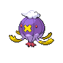
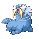
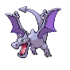
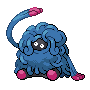
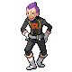
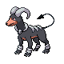

# Saffron City — Trainer Rosters

---

## Gym

### Generic Trainers

| Trainer | P1 | P2 | P3 | P4 | P5 | P6 |
|:-------:|:--:|:--:|:--:|:--:|:--:|:--:|
|  Medium Rebecca |  Bronzong Lv. 62 |  Claydol Lv. 62 |  Gardevoir Lv. 62 |
|  Psychic Jared |  Hypno Lv. 63 |  Girafarig Lv. 63 |  Medicham Lv. 63 |
|  Medium Darcy |  Slowbro Lv. 62 |  Mismagius Lv. 62 |  Dusclops Lv. 62 |  Mr. Mime Lv. 62 |
|  Psychic Franklin |  Metang Lv. 64 |  Xatu Lv. 64 |

### Important Trainers

1. [Leader Sabrina](important_trainers.md#leader-sabrina)

---

## Dojo

### Generic Trainers

| Trainer | P1 | P2 | P3 | P4 | P5 | P6 |
|:-------:|:--:|:--:|:--:|:--:|:--:|:--:|
| ") Leader Falkner (Sa4-9:59a) |  Fearow Lv. 68 |  Pelipper Lv. 64 |  Noctowl Lv. 66 |  Swellow Lv. 68 |  Staraptor Lv. 70 |  Pidgeot Lv. 72 |
| ") Leader Bugsy (Th10a–7:59p) |  Yanmega Lv. 70 |  Heracross Lv. 68 |  Vespiquen Lv. 68 |  Pinsir Lv. 69 |  Masquerain Lv. 70 |  Scizor Lv. 72 |
| ") Leader Whitney (Sa10a–7:59p) |  Stantler Lv. 71 |  Blissey Lv. 69 |  Lopunny Lv. 69 |  Togekiss Lv. 70 |  Clefable Lv. 72 |  Miltank Lv. 73 |
| ") Leader Morty (T8p-3:59a) |  Drifblim Lv. 72 |  Dusknoir Lv. 68 |  Banette Lv. 70 |  Spiritomb Lv. 70 |  Mismagius Lv. 72 |  Gengar Lv. 74 |
| ") Leader Chuck (W8p-3:59a) |  Hariyama Lv. 73 |  Medicham Lv. 70 |  Breloom Lv. 70 |  Blaziken Lv. 72 |  Primeape Lv. 73 |  Poliwrath Lv. 75 |
| ") Leader Jasmine (W10a–7:59p) |  Metagross Lv. 72 |  Empoleon Lv. 68 |  Aggron Lv. 68 |  Skarmory Lv. 70 |  Magnezone Lv. 74 |  Steelix Lv. 78 |
| ") Leader Pryce (M4-9:59a) |  Abomasnow Lv. 72 |  Walrein Lv. 70 |  Cloyster Lv. 72 |  Dewgong Lv. 74 |  Lapras Lv. 74 |  Mamoswine Lv. 76 |
| ") Leader Clair (F8p-3:59a) |  Dragonair Lv. 72 |  Aerodactyl Lv. 72 |  Altaria Lv. 74 |  Gyarados Lv. 76 |  Salamence Lv. 76 |  Kingdra Lv. 78 |
| ") Leader Brock (Sa8p-3:59a) |  Rampardos Lv. 69 |  Probopass Lv. 66 |  Sudowoodo Lv. 71 |  Kabutops Lv. 71 |  Omastar Lv. 71 |  Steelix Lv. 73 |
| ") Leader Misty (W4-9:59a) |  Politoed Lv. 68 |  Gorebyss Lv. 68 |  Lanturn Lv. 68 |  Quagsire Lv. 68 |  Milotic Lv. 72 |  Starmie Lv. 72 |
| ") Leader Lt. Surge (F4-9:59a) |  Electrode Lv. 72 |  Luxray Lv. 70 |  Manectric Lv. 70 |  Electivire Lv. 72 |  Magnezone Lv. 72 |  Raichu Lv. 74 |
| ") Leader Erika (Su4-9:59a) |  Jumpluff Lv. 73 |  Roserade Lv. 72 |  Tropius Lv. 73 |  Bellossom Lv. 75 |  Victreebel Lv. 75 |  Tangrowth Lv. 76 |
| ") Leader Janine (M10a–7:59p) |  Toxicroak Lv. 68 |  Nidoqueen Lv. 66 |  Tentacruel Lv. 68 |  Ariados Lv. 70 |  Drapion Lv. 70 |  Venomoth Lv. 72 |
| ") Leader Sabrina (S10a–7:59p) |  Wobbuffet Lv. 72 |  Jynx Lv. 70 |  Espeon Lv. 70 |  Gallade Lv. 72 |  Mr. Mime Lv. 74 |  Alakazam Lv. 76 |
| ") Leader Blaine (T10a–7:59p) |  Ninetales Lv. 74 |  Camerupt Lv. 72 |  Torkoal Lv. 72 |  Typhlosion Lv. 76 |  Rapidash Lv. 76 |  Magmortar Lv. 78 |
| ") Leader Blue (Su8p-3:59a) |  Gyarados Lv. 78 |  Alakazam Lv. 78 |  Tyranitar Lv. 80 |  Rhyperior Lv. 80 |  Exeggutor Lv. 80 |  Arcanine Lv. 82 |
|  Executive Proton |  Electrode Lv. 71 |  Cacturne Lv. 68 |  Tauros Lv. 68 |  Camerupt Lv. 68 |  Weezing Lv. 71 |  Crobat Lv. 73 |
|  Executive Petrel |  Raticate Lv. 72 |  Tangrowth Lv. 68 |  Skuntank Lv. 70 |  Toxicroak Lv. 72 |  Hypno Lv. 73 |  Weezing Lv. 75 |
|  Executive Ariana |  Jynx Lv. 72 |  Milotic Lv. 70 |  Purugly Lv. 72 |  Arbok Lv. 74 |  Vileplume Lv. 74 |  Honchkrow Lv. 76 |
|  Executive Archer |  Zangoose Lv. 77 |  Drapion Lv. 73 |  Gyarados Lv. 73 |  Scizor Lv. 75 |  Machamp Lv. 75 |  Houndoom Lv. 78 |
|  Rocket Boss Giovanni |  Persian Lv. 82 |  Kangaskhan Lv. 76 |  Rhyperior Lv. 76 |  Tyranitar Lv. 80 |  Nidoking Lv. 80 |  Nidoqueen Lv. 80 |

