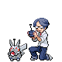

# Seafoam Islands — Trainer Rosters

### Generic Trainers

| Trainer | P1 | P2 | P3 | P4 | P5 | P6 |
|:-------:|:--:|:--:|:--:|:--:|:--:|:--:|
|  Skier Cady |  [Weavile](../../pokemon/weavile.md/) Lv. 65 |
|  Boarder Shaun |  [Cloyster](../../pokemon/cloyster.md/) Lv. 63 |  [Walrein](../../pokemon/walrein.md/) Lv. 63 |
|  Boarder Bryce |  [Dewgong](../../pokemon/dewgong.md/) Lv. 63 |  [Lapras](../../pokemon/lapras.md/) Lv. 63 |

---

## Gym

### Generic Trainers

| Trainer | P1 | P2 | P3 | P4 | P5 | P6 |
|:-------:|:--:|:--:|:--:|:--:|:--:|:--:|
|  Scientist Lowell |  [Arcanine](../../pokemon/arcanine.md/) Lv. 65 |  [Rapidash](../../pokemon/rapidash.md/) Lv. 65 |
|  Super Nerd Cary |  [Torkoal](../../pokemon/torkoal.md/) Lv. 65 |  [Typhlosion](../../pokemon/typhlosion.md/) Lv. 65 |
|  Scientist Linden |  [Magmar](../../pokemon/magmar.md/) Lv. 65 |  [Infernape](../../pokemon/infernape.md/) Lv. 65 |
|  Super Nerd Waldo |  [Camerupt](../../pokemon/camerupt.md/) Lv. 65 |  [Blaziken](../../pokemon/blaziken.md/) Lv. 65 |
|  Super Nerd Merle |  [Magcargo](../../pokemon/magcargo.md/) Lv. 65 |  [Houndoom](../../pokemon/houndoom.md/) Lv. 65 |
|  Scientist Daniel |  [Charizard](../../pokemon/charizard.md/) Lv. 65 |  [Ninetales](../../pokemon/ninetales.md/) Lv. 65 |

### Important Trainers

1. [Leader Blaine](important_trainers.md#leader-blaine)
