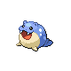

# Seafoam Islands — Wild Pokémon

---

## Rock Smash

### Cave

| Sprite | Pokémon | Encounter Type | Level | Chance |
|:------:|---------|:--------------:|-------|--------|
|  | Zubat | {: style="max-width: 24px;"" } | 48 – 58 | 30% |
|  | Psyduck | {: style="max-width: 24px;"" } | 48 – 58 | 30% |
|  | Slowpoke | {: style="max-width: 24px;"" } | 48 – 58 | 30% |
|  | Golbat | {: style="max-width: 24px;"" } | 48 – 58 | 10% |

### Meridian Sound

| Sprite | Pokémon | Encounter Type | Level | Chance |
|:------:|---------|:--------------:|-------|--------|
|  | Golduck | {: style="max-width: 24px;"" } | 48 – 58 | 50% |
|  | Slowbro | {: style="max-width: 24px;"" } | 48 – 58 | 50% |

### Pastoral Sound

| Sprite | Pokémon | Encounter Type | Level | Chance |
|:------:|---------|:--------------:|-------|--------|
|  | Staryu | {: style="max-width: 24px;"" } | 48 – 58 | 100% |

---

## Pastoral Sound

### Cave

| Sprite | Pokémon | Encounter Type | Level | Chance |
|:------:|---------|:--------------:|-------|--------|
|  | Seel | {: style="max-width: 24px;"" } | 49 – 59 | 25% |
|  | Golbat | {: style="max-width: 24px;"" } | 49 – 59 | 20% |
|  | Slowbro | {: style="max-width: 24px;"" } | 49 – 59 | 20% |
|  | Piloswine | {: style="max-width: 24px;"" } | 49 – 59 | 20% |
|  | Snorunt | {: style="max-width: 24px;"" } | 49 – 59 | 15% |

### Meridian Sound

| Sprite | Pokémon | Encounter Type | Level | Chance |
|:------:|---------|:--------------:|-------|--------|
|  | Glalie | {: style="max-width: 24px;"" } | 49 – 59 | 50% |
|  | Froslass | {: style="max-width: 24px;"" } | 49 – 59 | 50% |

### Pastoral Sound

| Sprite | Pokémon | Encounter Type | Level | Chance |
|:------:|---------|:--------------:|-------|--------|
|  | Kingler | {: style="max-width: 24px;"" } | 49 – 59 | 50% |
|  | Golduck | {: style="max-width: 24px;"" } | 49 – 59 | 50% |

---

## Pastoral Sound

### Cave

| Sprite | Pokémon | Encounter Type | Level | Chance |
|:------:|---------|:--------------:|-------|--------|
|  | Golbat | {: style="max-width: 24px;"" } | 56 – 60 | 35% |
|  | Dewgong | {: style="max-width: 24px;"" } | 56 – 60 | 20% |
|  | Kingler | {: style="max-width: 24px;"" } | 56 – 60 | 10% |
|  | Piloswine | {: style="max-width: 24px;"" } | 56 – 60 | 10% |
|  | Slowbro | {: style="max-width: 24px;"" } | 56 – 60 | 10% |
|  | Sealeo | {: style="max-width: 24px;"" } | 56 – 60 | 10% |
|  | Glalie | {: style="max-width: 24px;"" } | 56 – 60 | 5% |

### Meridian Sound

| Sprite | Pokémon | Encounter Type | Level | Chance |
|:------:|---------|:--------------:|-------|--------|
|  | Walrein | {: style="max-width: 24px;"" } | 56 – 60 | 50% |
|  | Mamoswine | {: style="max-width: 24px;"" } | 56 – 60 | 50% |

### Pastoral Sound

| Sprite | Pokémon | Encounter Type | Level | Chance |
|:------:|---------|:--------------:|-------|--------|
|  | Froslass | {: style="max-width: 24px;"" } | 56 – 60 | 50% |
|  | Slowking | {: style="max-width: 24px;"" } | 56 – 60 | 50% |

---

## Pastoral Sound

### Cave

| Sprite | Pokémon | Encounter Type | Level | Chance |
|:------:|---------|:--------------:|-------|--------|
|  | Golbat | {: style="max-width: 24px;"" } | 56 – 60 | 25% |
|  | Dewgong | {: style="max-width: 24px;"" } | 56 – 60 | 20% |
|  | Kingler | {: style="max-width: 24px;"" } | 56 – 60 | 10% |
|  | Sealeo | {: style="max-width: 24px;"" } | 56 – 60 | 10% |
|  | Piloswine | {: style="max-width: 24px;"" } | 56 – 60 | 10% |
|  | Glalie | {: style="max-width: 24px;"" } | 56 – 60 | 10% |
|  | Delibird | {: style="max-width: 24px;"" } | 56 – 60 | 5% |
|  | Sneasel | {: style="max-width: 24px;"" } | 56 – 60 | 5% |
|  | Jynx | {: style="max-width: 24px;"" } | 56 – 60 | 5% |

### Meridian Sound

| Sprite | Pokémon | Encounter Type | Level | Chance |
|:------:|---------|:--------------:|-------|--------|
|  | Weavile | {: style="max-width: 24px;"" } | 56 – 60 | 50% |
|  | Mamoswine | {: style="max-width: 24px;"" } | 56 – 60 | 50% |

### Pastoral Sound

| Sprite | Pokémon | Encounter Type | Level | Chance |
|:------:|---------|:--------------:|-------|--------|
|  | Delibird | {: style="max-width: 24px;"" } | 56 – 60 | 50% |
|  | Jynx | {: style="max-width: 24px;"" } | 56 – 60 | 50% |

---

## Pastoral Sound

### Cave

| Sprite | Pokémon | Encounter Type | Level | Chance |
|:------:|---------|:--------------:|-------|--------|
|  | Golbat | {: style="max-width: 24px;"" } | 57 – 60 | 25% |
|  | Dewgong | {: style="max-width: 24px;"" } | 57 – 60 | 20% |
|  | Kingler | {: style="max-width: 24px;"" } | 57 – 60 | 10% |
|  | Sealeo | {: style="max-width: 24px;"" } | 57 – 60 | 10% |
|  | Piloswine | {: style="max-width: 24px;"" } | 57 – 60 | 10% |
|  | Glalie | {: style="max-width: 24px;"" } | 57 – 60 | 10% |
|  | Delibird | {: style="max-width: 24px;"" } | 57 – 60 | 5% |
|  | Sneasel | {: style="max-width: 24px;"" } | 57 – 60 | 5% |
|  | Jynx | {: style="max-width: 24px;"" } | 57 – 60 | 5% |

### Meridian Sound

| Sprite | Pokémon | Encounter Type | Level | Chance |
|:------:|---------|:--------------:|-------|--------|
|  | Crobat | {: style="max-width: 24px;"" } | 57 – 60 | 50% |
|  | Walrein | {: style="max-width: 24px;"" } | 57 – 60 | 50% |

### Pastoral Sound

| Sprite | Pokémon | Encounter Type | Level | Chance |
|:------:|---------|:--------------:|-------|--------|
|  | Lapras | {: style="max-width: 24px;"" } | 57 – 60 | 100% |

### Surf

| Sprite | Pokémon | Encounter Type | Level | Chance |
|:------:|---------|:--------------:|-------|--------|
|  | Spheal | {: style="max-width: 24px;"" } | 57 – 60 | 60% |
|  | Tentacool | {: style="max-width: 24px;"" } | 57 – 60 | 30% |
|  | Staryu | {: style="max-width: 24px;"" } | 57 – 60 | 8% |
|  | Lapras | {: style="max-width: 24px;"" } | 57 – 60 | 2% |

### Old Rod

| Sprite | Pokémon | Encounter Type | Level | Chance |
|:------:|---------|:--------------:|-------|--------|
|  | Magikarp | {: style="max-width: 24px;"" } | 10 | 90% |
|  | Horsea | {: style="max-width: 24px;"" } | 10 | 5% |
|  | Krabby | {: style="max-width: 24px;"" } | 10 | 5% |

### Good Rod

| Sprite | Pokémon | Encounter Type | Level | Chance |
|:------:|---------|:--------------:|-------|--------|
|  | Magikarp | {: style="max-width: 24px;"" } | 25 | 60% |
|  | Krabby | {: style="max-width: 24px;"" } | 25 | 30% |
|  | Horsea | {: style="max-width: 24px;"" } | 25 | 5% |
|  | Shellder | {: style="max-width: 24px;"" } | 25 | 5% |

### Super Rod

| Sprite | Pokémon | Encounter Type | Level | Chance |
|:------:|---------|:--------------:|-------|--------|
|  | Gyarados | {: style="max-width: 24px;"" } | 50 | 60% |
|  | Seadra | {: style="max-width: 24px;"" } | 50 | 30% |
|  | Shellder | {: style="max-width: 24px;"" } | 50 | 5% |
|  | Kingler | {: style="max-width: 24px;"" } | 50 | 5% |

