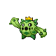

# Slowpoke Well — Important Trainers

### Executive Proton

| Pokémon | Attributes | Item | Moves |
|:-------:|------------|:----:|-------|
|  | **Lv. 17** Voltorb **Ability:** Aftermath  | None | 1. Spark 2. Screech 3. Self Destruct 4. Toxic |
|  | **Lv. 17** Cacnea **Ability:** Sand Veil  | None | 1. Needle Arm 2. Sucker Punch 3. Leer 4. Toxic |
|  | **Lv. 17** Zubat **Ability:** Inner Focus   | None | 1. Wing Attack 2. Giga Drain 3. Supersonic 4. Toxic |
|  | **Lv. 18** Koffing **Ability:** Levitate  | None | 1. Sludge Bomb 2. Self Destruct 3. Flamethrower 4. Toxic |

