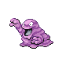

# Trainer Rosters

### Generic Trainers

| Trainer | P1 | P2 | P3 | P4 | P5 | P6 |
|:-------:|:--:|:--:|:--:|:--:|:--:|:--:|
|  Team Rocket Grunt |  [Rattata](../../pokemon/rattata.md/) Lv. 16 |  [Zubat](../../pokemon/zubat.md/) Lv. 16 |  [Ekans](../../pokemon/ekans.md/) Lv. 16 |
|  Team Rocket Grunt |  [Grimer](../../pokemon/grimer.md/) Lv. 17 |  [Geodude](../../pokemon/geodude.md/) Lv. 17 |  [Poochyena](../../pokemon/poochyena.md/) Lv. 17 |
|  Team Rocket Grunt |  [Cacnea](../../pokemon/cacnea.md/) Lv. 18 |  [Nidorina](../../pokemon/nidorina.md/) Lv. 18 |

### Important Trainers

1. [Executive Proton](important_trainers.md#executive-proton)
