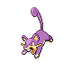
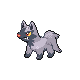

# Slowpoke Well — Trainer Rosters

### Generic Trainers

| Trainer | P1 | P2 | P3 | P4 | P5 | P6 |
|:-------:|:--:|:--:|:--:|:--:|:--:|:--:|
|  Team Rocket Grunt |  Rattata Lv. 16 |  Zubat Lv. 16 |  Ekans Lv. 16 |
|  Team Rocket Grunt |  Grimer Lv. 17 |  Geodude Lv. 17 |  Poochyena Lv. 17 |
|  Team Rocket Grunt |  Cacnea Lv. 18 |  Nidorina Lv. 18 |

### Important Trainers

1. [Executive Proton](important_trainers.md#executive-proton)
