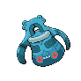

# Slowpoke Well — Wild Pokémon

---

## Pastoral Sound

### Cave

| Sprite | Pokémon | Encounter Type | Level | Chance |
|:------:|---------|:--------------:|-------|--------|
|  | [Zubat](../../pokemon/zubat.md) | {: style="max-width: 24px;"" }| 15 – 16 | 20% |
|  | [Slowpoke](../../pokemon/slowpoke.md) | {: style="max-width: 24px;"" }| 15 – 16 | 20% |
|  | [Gastly](../../pokemon/gastly.md) | {: style="max-width: 24px;"" }| 15 – 16 | 10% |
|  | [Shellos](../../pokemon/shellos.md) | {: style="max-width: 24px;"" }| 15 – 16 | 10% |
|  | [Shellder](../../pokemon/shellder.md) | {: style="max-width: 24px;"" }| 15 – 16 | 10% |
|  | [Swinub](../../pokemon/swinub.md) | {: style="max-width: 24px;"" }| 15 – 16 | 10% |
|  | [Snorunt](../../pokemon/snorunt.md) | {: style="max-width: 24px;"" }| 15 – 16 | 10% |
|  | [Bronzor](../../pokemon/bronzor.md) | {: style="max-width: 24px;"" }| 15 – 16 | 10% |

### Surf

| Sprite | Pokémon | Encounter Type | Level | Chance |
|:------:|---------|:--------------:|-------|--------|
|  | [Slowpoke](../../pokemon/slowpoke.md) | {: style="max-width: 24px;"" }| 15 – 16 | 90% |
|  | [Slowbro](../../pokemon/slowbro.md) | {: style="max-width: 24px;"" }| 15 – 16 | 10% |

### Old Rod

| Sprite | Pokémon | Encounter Type | Level | Chance |
|:------:|---------|:--------------:|-------|--------|
|  | [Magikarp](../../pokemon/magikarp.md) | {: style="max-width: 24px;"" }| 10 | 60% |
|  | [Slowpoke](../../pokemon/slowpoke.md) | {: style="max-width: 24px;"" }| 10 | 30% |
|  | [Barboach](../../pokemon/barboach.md) | {: style="max-width: 24px;"" }| 10 | 10% |

### Good Rod

| Sprite | Pokémon | Encounter Type | Level | Chance |
|:------:|---------|:--------------:|-------|--------|
|  | [Magikarp](../../pokemon/magikarp.md) | {: style="max-width: 24px;"" }| 25 | 60% |
|  | [Barboach](../../pokemon/barboach.md) | {: style="max-width: 24px;"" }| 25 | 30% |
|  | [Slowpoke](../../pokemon/slowpoke.md) | {: style="max-width: 24px;"" }| 25 | 10% |

### Super Rod

| Sprite | Pokémon | Encounter Type | Level | Chance |
|:------:|---------|:--------------:|-------|--------|
|  | [Gyarados](../../pokemon/gyarados.md) | {: style="max-width: 24px;"" }| 50 | 60% |
|  | [Whiscash](../../pokemon/whiscash.md) | {: style="max-width: 24px;"" }| 50 | 30% |
|  | [Slowbro](../../pokemon/slowbro.md) | {: style="max-width: 24px;"" }| 50 | 10% |

### Meridian Sound

| Sprite | Pokémon | Encounter Type | Level | Chance |
|:------:|---------|:--------------:|-------|--------|
|  | [Slowbro](../../pokemon/slowbro.md) | {: style="max-width: 24px;"" }| 15 – 16 | 100% |

### Pastoral Sound

| Sprite | Pokémon | Encounter Type | Level | Chance |
|:------:|---------|:--------------:|-------|--------|
|  | [Wynaut](../../pokemon/wynaut.md) | {: style="max-width: 24px;"" }| 15 – 16 | 100% |

---

## Pastoral Sound

### Cave

| Sprite | Pokémon | Encounter Type | Level | Chance |
|:------:|---------|:--------------:|-------|--------|
|  | [Golbat](../../pokemon/golbat.md) | {: style="max-width: 24px;"" }| 28 – 33 | 20% |
|  | [Slowpoke](../../pokemon/slowpoke.md) | {: style="max-width: 24px;"" }| 28 – 33 | 20% |
|  | [Haunter](../../pokemon/haunter.md) | {: style="max-width: 24px;"" }| 28 – 33 | 10% |
|  | [Gastrodon](../../pokemon/gastrodon.md) | {: style="max-width: 24px;"" }| 28 – 33 | 10% |
|  | [Shellder](../../pokemon/shellder.md) | {: style="max-width: 24px;"" }| 28 – 33 | 10% |
|  | [Piloswine](../../pokemon/piloswine.md) | {: style="max-width: 24px;"" }| 28 – 33 | 10% |
|  | [Snorunt](../../pokemon/snorunt.md) | {: style="max-width: 24px;"" }| 28 – 33 | 10% |
|  | [Bronzong](../../pokemon/bronzong.md) | {: style="max-width: 24px;"" }| 28 – 33 | 10% |

### Surf

| Sprite | Pokémon | Encounter Type | Level | Chance |
|:------:|---------|:--------------:|-------|--------|
|  | [Slowpoke](../../pokemon/slowpoke.md) | {: style="max-width: 24px;"" }| 28 – 33 | 60% |
|  | [Slowbro](../../pokemon/slowbro.md) | {: style="max-width: 24px;"" }| 28 – 33 | 40% |

### Old Rod

| Sprite | Pokémon | Encounter Type | Level | Chance |
|:------:|---------|:--------------:|-------|--------|
|  | [Magikarp](../../pokemon/magikarp.md) | {: style="max-width: 24px;"" }| 10 | 60% |
|  | [Slowpoke](../../pokemon/slowpoke.md) | {: style="max-width: 24px;"" }| 10 | 30% |
|  | [Barboach](../../pokemon/barboach.md) | {: style="max-width: 24px;"" }| 10 | 10% |

### Good Rod

| Sprite | Pokémon | Encounter Type | Level | Chance |
|:------:|---------|:--------------:|-------|--------|
|  | [Magikarp](../../pokemon/magikarp.md) | {: style="max-width: 24px;"" }| 25 | 60% |
|  | [Barboach](../../pokemon/barboach.md) | {: style="max-width: 24px;"" }| 25 | 30% |
|  | [Slowpoke](../../pokemon/slowpoke.md) | {: style="max-width: 24px;"" }| 25 | 10% |

### Super Rod

| Sprite | Pokémon | Encounter Type | Level | Chance |
|:------:|---------|:--------------:|-------|--------|
|  | [Gyarados](../../pokemon/gyarados.md) | {: style="max-width: 24px;"" }| 50 | 60% |
|  | [Whiscash](../../pokemon/whiscash.md) | {: style="max-width: 24px;"" }| 50 | 30% |
|  | [Slowbro](../../pokemon/slowbro.md) | {: style="max-width: 24px;"" }| 50 | 10% |

### Meridian Sound

| Sprite | Pokémon | Encounter Type | Level | Chance |
|:------:|---------|:--------------:|-------|--------|
|  | [Slowbro](../../pokemon/slowbro.md) | {: style="max-width: 24px;"" }| 28 – 33 | 50% |
|  | [Glalie](../../pokemon/glalie.md) | {: style="max-width: 24px;"" }| 28 – 33 | 50% |

### Pastoral Sound

| Sprite | Pokémon | Encounter Type | Level | Chance |
|:------:|---------|:--------------:|-------|--------|
|  | [Wobbuffet](../../pokemon/wobbuffet.md) | {: style="max-width: 24px;"" }| 28 – 33 | 100% |

