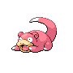
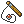

# Slowpoke Well — Wild Pokémon

---

## Pastoral Sound

### Cave

| Sprite | Pokémon | Encounter Type | Level | Chance |
|:------:|---------|:--------------:|-------|--------|
|  | Zubat | {: style="max-width: 24px;"" } | 15 – 16 | 20% |
|  | Slowpoke | {: style="max-width: 24px;"" } | 15 – 16 | 20% |
|  | Gastly | {: style="max-width: 24px;"" } | 15 – 16 | 10% |
|  | Shellos | {: style="max-width: 24px;"" } | 15 – 16 | 10% |
|  | Shellder | {: style="max-width: 24px;"" } | 15 – 16 | 10% |
|  | Swinub | {: style="max-width: 24px;"" } | 15 – 16 | 10% |
|  | Snorunt | {: style="max-width: 24px;"" } | 15 – 16 | 10% |
|  | Bronzor | {: style="max-width: 24px;"" } | 15 – 16 | 10% |

### Surf

| Sprite | Pokémon | Encounter Type | Level | Chance |
|:------:|---------|:--------------:|-------|--------|
|  | Slowpoke | {: style="max-width: 24px;"" } | 15 – 16 | 90% |
|  | Slowbro | {: style="max-width: 24px;"" } | 15 – 16 | 10% |

### Old Rod

| Sprite | Pokémon | Encounter Type | Level | Chance |
|:------:|---------|:--------------:|-------|--------|
|  | Magikarp | {: style="max-width: 24px;"" } | 10 | 60% |
|  | Slowpoke | {: style="max-width: 24px;"" } | 10 | 30% |
|  | Barboach | {: style="max-width: 24px;"" } | 10 | 10% |

### Good Rod

| Sprite | Pokémon | Encounter Type | Level | Chance |
|:------:|---------|:--------------:|-------|--------|
|  | Magikarp | {: style="max-width: 24px;"" } | 25 | 60% |
|  | Barboach | {: style="max-width: 24px;"" } | 25 | 30% |
|  | Slowpoke | {: style="max-width: 24px;"" } | 25 | 10% |

### Super Rod

| Sprite | Pokémon | Encounter Type | Level | Chance |
|:------:|---------|:--------------:|-------|--------|
|  | Gyarados | {: style="max-width: 24px;"" } | 50 | 60% |
|  | Whiscash | {: style="max-width: 24px;"" } | 50 | 30% |
|  | Slowbro | {: style="max-width: 24px;"" } | 50 | 10% |

### Meridian Sound

| Sprite | Pokémon | Encounter Type | Level | Chance |
|:------:|---------|:--------------:|-------|--------|
|  | Slowbro | {: style="max-width: 24px;"" } | 15 – 16 | 100% |

### Pastoral Sound

| Sprite | Pokémon | Encounter Type | Level | Chance |
|:------:|---------|:--------------:|-------|--------|
|  | Wynaut | {: style="max-width: 24px;"" } | 15 – 16 | 100% |

---

## Pastoral Sound

### Cave

| Sprite | Pokémon | Encounter Type | Level | Chance |
|:------:|---------|:--------------:|-------|--------|
|  | Golbat | {: style="max-width: 24px;"" } | 28 – 33 | 20% |
|  | Slowpoke | {: style="max-width: 24px;"" } | 28 – 33 | 20% |
|  | Haunter | {: style="max-width: 24px;"" } | 28 – 33 | 10% |
|  | Gastrodon | {: style="max-width: 24px;"" } | 28 – 33 | 10% |
|  | Shellder | {: style="max-width: 24px;"" } | 28 – 33 | 10% |
|  | Piloswine | {: style="max-width: 24px;"" } | 28 – 33 | 10% |
|  | Snorunt | {: style="max-width: 24px;"" } | 28 – 33 | 10% |
|  | Bronzong | {: style="max-width: 24px;"" } | 28 – 33 | 10% |

### Surf

| Sprite | Pokémon | Encounter Type | Level | Chance |
|:------:|---------|:--------------:|-------|--------|
|  | Slowpoke | {: style="max-width: 24px;"" } | 28 – 33 | 60% |
|  | Slowbro | {: style="max-width: 24px;"" } | 28 – 33 | 40% |

### Old Rod

| Sprite | Pokémon | Encounter Type | Level | Chance |
|:------:|---------|:--------------:|-------|--------|
|  | Magikarp | {: style="max-width: 24px;"" } | 10 | 60% |
|  | Slowpoke | {: style="max-width: 24px;"" } | 10 | 30% |
|  | Barboach | {: style="max-width: 24px;"" } | 10 | 10% |

### Good Rod

| Sprite | Pokémon | Encounter Type | Level | Chance |
|:------:|---------|:--------------:|-------|--------|
|  | Magikarp | {: style="max-width: 24px;"" } | 25 | 60% |
|  | Barboach | {: style="max-width: 24px;"" } | 25 | 30% |
|  | Slowpoke | {: style="max-width: 24px;"" } | 25 | 10% |

### Super Rod

| Sprite | Pokémon | Encounter Type | Level | Chance |
|:------:|---------|:--------------:|-------|--------|
|  | Gyarados | {: style="max-width: 24px;"" } | 50 | 60% |
|  | Whiscash | {: style="max-width: 24px;"" } | 50 | 30% |
|  | Slowbro | {: style="max-width: 24px;"" } | 50 | 10% |

### Meridian Sound

| Sprite | Pokémon | Encounter Type | Level | Chance |
|:------:|---------|:--------------:|-------|--------|
|  | Slowbro | {: style="max-width: 24px;"" } | 28 – 33 | 50% |
|  | Glalie | {: style="max-width: 24px;"" } | 28 – 33 | 50% |

### Pastoral Sound

| Sprite | Pokémon | Encounter Type | Level | Chance |
|:------:|---------|:--------------:|-------|--------|
|  | Wobbuffet | {: style="max-width: 24px;"" } | 28 – 33 | 100% |

