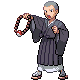
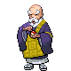

# Trainer Rosters

### Generic Trainers

| Trainer | P1 | P2 | P3 | P4 | P5 | P6 |
|:-------:|:--:|:--:|:--:|:--:|:--:|:--:|
|  Sage Nico |  Sunkern Lv. 8 |  Bellsprout Lv. 8 |  Ralts Lv. 8 |  Bellsprout Lv. 8 |
|  Sage Chow |  Bellsprout Lv. 9 |  Poliwag Lv. 9 |  Exeggcute Lv. 9 |
|  Sage Edmond |  Mareep Lv. 10 |  Oddish Lv. 10 |  Hoothoot Lv. 10 |
|  Sage Jin |  Bellsprout Lv. 12 |
|  Sage Neal |  Psyduck Lv. 11 |  Natu Lv. 11 |  Bulbasaur Lv. 11 |
|  Sage Troy |  Abra Lv. 12 |  Hoothoot Lv. 12 |  Hoppip Lv. 12 |  Exeggcute Lv. 12 |
|  Elder Li |  Bellsprout Lv. 12 |  Chingling Lv. 12 |  Cherubi Lv. 12 |  Hoothoot Lv. 14 |

