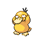

# Trainer Rosters

### Generic Trainers

| Trainer | P1 | P2 | P3 | P4 | P5 | P6 |
|:-------:|:--:|:--:|:--:|:--:|:--:|:--:|
|  Sage Nico |  [Sunkern](../../pokemon/sunkern.md/) Lv. 8 |  [Bellsprout](../../pokemon/bellsprout.md/) Lv. 8 |  [Ralts](../../pokemon/ralts.md/) Lv. 8 |  [Bellsprout](../../pokemon/bellsprout.md/) Lv. 8 |
|  Sage Chow |  [Bellsprout](../../pokemon/bellsprout.md/) Lv. 9 |  [Poliwag](../../pokemon/poliwag.md/) Lv. 9 |  [Exeggcute](../../pokemon/exeggcute.md/) Lv. 9 |
|  Sage Edmond |  [Mareep](../../pokemon/mareep.md/) Lv. 10 |  [Oddish](../../pokemon/oddish.md/) Lv. 10 |  [Hoothoot](../../pokemon/hoothoot.md/) Lv. 10 |
|  Sage Jin |  [Bellsprout](../../pokemon/bellsprout.md/) Lv. 12 |
|  Sage Neal |  [Psyduck](../../pokemon/psyduck.md/) Lv. 11 |  [Natu](../../pokemon/natu.md/) Lv. 11 |  [Bulbasaur](../../pokemon/bulbasaur.md/) Lv. 11 |
|  Sage Troy |  [Abra](../../pokemon/abra.md/) Lv. 12 |  [Hoothoot](../../pokemon/hoothoot.md/) Lv. 12 |  [Hoppip](../../pokemon/hoppip.md/) Lv. 12 |  [Exeggcute](../../pokemon/exeggcute.md/) Lv. 12 |
|  Elder Li |  [Bellsprout](../../pokemon/bellsprout.md/) Lv. 12 |  [Chingling](../../pokemon/chingling.md/) Lv. 12 |  [Cherubi](../../pokemon/cherubi.md/) Lv. 12 |  [Hoothoot](../../pokemon/hoothoot.md/) Lv. 14 |

