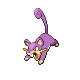
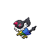

# Sprout Tower — Wild Pokémon

---

## Super Rod

### Building, Morning / Day

| Sprite | Pokémon | Encounter Type | Level | Chance |
|:------:|---------|:--------------:|-------|--------|
|  | [Zigzagoon](../../pokemon/zigzagoon.md) | encounter_sprites| 9 – 12 | 20% |
|  | [Rattata](../../pokemon/rattata.md) | encounter_sprites| 9 – 12 | 20% |
|  | [Pidgey](../../pokemon/pidgey.md) | encounter_sprites| 9 – 12 | 20% |
|  | [Bidoof](../../pokemon/bidoof.md) | encounter_sprites| 9 – 12 | 10% |
|  | [Starly](../../pokemon/starly.md) | encounter_sprites| 9 – 12 | 10% |
|  | [Meditite](../../pokemon/meditite.md) | encounter_sprites| 9 – 12 | 10% |
|  | [Spinda](../../pokemon/spinda.md) | encounter_sprites| 9 – 12 | 5% |
|  | [Chatot](../../pokemon/chatot.md) | encounter_sprites| 9 – 12 | 5% |

### Building, Night

| Sprite | Pokémon | Encounter Type | Level | Chance |
|:------:|---------|:--------------:|-------|--------|
|  | [Gastly](../../pokemon/gastly.md) | encounter_sprites| 9 – 12 | 20% |
|  | [Rattata](../../pokemon/rattata.md) | encounter_sprites| 9 – 12 | 20% |
|  | [Bellsprout](../../pokemon/bellsprout.md) | encounter_sprites| 9 – 12 | 20% |
|  | [Bidoof](../../pokemon/bidoof.md) | encounter_sprites| 9 – 12 | 10% |
|  | [Glameow](../../pokemon/glameow.md) | encounter_sprites| 9 – 12 | 10% |
|  | [Stunky](../../pokemon/stunky.md) | encounter_sprites| 9 – 12 | 10% |
|  | [Spinda](../../pokemon/spinda.md) | encounter_sprites| 9 – 12 | 5% |
|  | [Drifloon](../../pokemon/drifloon.md) | encounter_sprites| 9 – 12 | 5%)Meridia |

### Meridian Sound

| Sprite | Pokémon | Encounter Type | Level | Chance |
|:------:|---------|:--------------:|-------|--------|
|  | [Bibarel](../../pokemon/bibarel.md) | encounter_sprites| 9 – 12 | 50% |
|  | [Linoone](../../pokemon/linoone.md) | encounter_sprites| 9 – 12 | 50% |

### Pastoral Sound

| Sprite | Pokémon | Encounter Type | Level | Chance |
|:------:|---------|:--------------:|-------|--------|
|  | [Spinda](../../pokemon/spinda.md) | encounter_sprites| 9 – 12 | 100% |

---

## Pastoral Sound

### Building, Morning / Day

| Sprite | Pokémon | Encounter Type | Level | Chance |
|:------:|---------|:--------------:|-------|--------|
|  | [Zigzagoon](../../pokemon/zigzagoon.md) | encounter_sprites| 10 – 13 | 20% |
|  | [Rattata](../../pokemon/rattata.md) | encounter_sprites| 10 – 13 | 20% |
|  | [Pidgey](../../pokemon/pidgey.md) | encounter_sprites| 10 – 13 | 20% |
|  | [Bidoof](../../pokemon/bidoof.md) | encounter_sprites| 10 – 13 | 10% |
|  | [Starly](../../pokemon/starly.md) | encounter_sprites| 10 – 13 | 10% |
|  | [Meditite](../../pokemon/meditite.md) | encounter_sprites| 10 – 13 | 10% |
|  | [Spinda](../../pokemon/spinda.md) | encounter_sprites| 10 – 13 | 5% |
|  | [Chatot](../../pokemon/chatot.md) | encounter_sprites| 10 – 13 | 5% |

### Building, Night

| Sprite | Pokémon | Encounter Type | Level | Chance |
|:------:|---------|:--------------:|-------|--------|
|  | [Gastly](../../pokemon/gastly.md) | encounter_sprites| 10 – 13 | 20% |
|  | [Rattata](../../pokemon/rattata.md) | encounter_sprites| 10 – 13 | 20% |
|  | [Bellsprout](../../pokemon/bellsprout.md) | encounter_sprites| 10 – 13 | 20% |
|  | [Bidoof](../../pokemon/bidoof.md) | encounter_sprites| 10 – 13 | 10% |
|  | [Glameow](../../pokemon/glameow.md) | encounter_sprites| 10 – 13 | 10% |
|  | [Stunky](../../pokemon/stunky.md) | encounter_sprites| 10 – 13 | 10% |
|  | [Spinda](../../pokemon/spinda.md) | encounter_sprites| 10 – 13 | 5% |
|  | [Drifloon](../../pokemon/drifloon.md) | encounter_sprites| 10 – 13 | 5% |

### Meridian Sound

| Sprite | Pokémon | Encounter Type | Level | Chance |
|:------:|---------|:--------------:|-------|--------|
|  | [Bibarel](../../pokemon/bibarel.md) | encounter_sprites| 10 – 13 | 50% |
|  | [Linoone](../../pokemon/linoone.md) | encounter_sprites| 10 – 13 | 50% |

### Pastoral Sound

| Sprite | Pokémon | Encounter Type | Level | Chance |
|:------:|---------|:--------------:|-------|--------|
|  | [Spinda](../../pokemon/spinda.md) | encounter_sprites| 10 – 13 | 100% |

