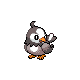

# Sprout Tower Wild Pokémon

---

## Super Rod

### Building, Morning / Day

| Sprite | Pokémon | Encounter Type | Level | Chance |
|:------:|---------|:--------------:|-------|--------|
|  | Zigzagoon | {: style="max-width: 24px;"" } {: style="max-width: 24px;"" } {: style="max-width: 24px;"" } | 9 – 12 | 20% |
|  | Rattata | {: style="max-width: 24px;"" } {: style="max-width: 24px;"" } {: style="max-width: 24px;"" } | 9 – 12 | 20% |
|  | Pidgey | {: style="max-width: 24px;"" } {: style="max-width: 24px;"" } {: style="max-width: 24px;"" } | 9 – 12 | 20% |
|  | Bidoof | {: style="max-width: 24px;"" } {: style="max-width: 24px;"" } {: style="max-width: 24px;"" } | 9 – 12 | 10% |
|  | Starly | {: style="max-width: 24px;"" } {: style="max-width: 24px;"" } {: style="max-width: 24px;"" } | 9 – 12 | 10% |
|  | Meditite | {: style="max-width: 24px;"" } {: style="max-width: 24px;"" } {: style="max-width: 24px;"" } | 9 – 12 | 10% |
|  | Spinda | {: style="max-width: 24px;"" } {: style="max-width: 24px;"" } {: style="max-width: 24px;"" } | 9 – 12 | 5% |
|  | Chatot | {: style="max-width: 24px;"" } {: style="max-width: 24px;"" } {: style="max-width: 24px;"" } | 9 – 12 | 5% |

### Building, Night

| Sprite | Pokémon | Encounter Type | Level | Chance |
|:------:|---------|:--------------:|-------|--------|
|  | Gastly | {: style="max-width: 24px;"" } {: style="max-width: 24px;"" } | 9 – 12 | 20% |
|  | Rattata | {: style="max-width: 24px;"" } {: style="max-width: 24px;"" } | 9 – 12 | 20% |
|  | Bellsprout | {: style="max-width: 24px;"" } {: style="max-width: 24px;"" } | 9 – 12 | 20% |
|  | Bidoof | {: style="max-width: 24px;"" } {: style="max-width: 24px;"" } | 9 – 12 | 10% |
|  | Glameow | {: style="max-width: 24px;"" } {: style="max-width: 24px;"" } | 9 – 12 | 10% |
|  | Stunky | {: style="max-width: 24px;"" } {: style="max-width: 24px;"" } | 9 – 12 | 10% |
|  | Spinda | {: style="max-width: 24px;"" } {: style="max-width: 24px;"" } | 9 – 12 | 5% |
|  | Drifloon | {: style="max-width: 24px;"" } {: style="max-width: 24px;"" } | 9 – 12 | 5%)Meridia |

### Meridian Sound

| Sprite | Pokémon | Encounter Type | Level | Chance |
|:------:|---------|:--------------:|-------|--------|
|  | Bibarel | {: style="max-width: 24px;"" } | 9 – 12 | 50% |
|  | Linoone | {: style="max-width: 24px;"" } | 9 – 12 | 50% |

### Pastoral Sound

| Sprite | Pokémon | Encounter Type | Level | Chance |
|:------:|---------|:--------------:|-------|--------|
|  | Spinda | {: style="max-width: 24px;"" } | 9 – 12 | 100% |

---

## Pastoral Sound

### Building, Morning / Day

| Sprite | Pokémon | Encounter Type | Level | Chance |
|:------:|---------|:--------------:|-------|--------|
|  | Zigzagoon | {: style="max-width: 24px;"" } {: style="max-width: 24px;"" } {: style="max-width: 24px;"" } | 10 – 13 | 20% |
|  | Rattata | {: style="max-width: 24px;"" } {: style="max-width: 24px;"" } {: style="max-width: 24px;"" } | 10 – 13 | 20% |
|  | Pidgey | {: style="max-width: 24px;"" } {: style="max-width: 24px;"" } {: style="max-width: 24px;"" } | 10 – 13 | 20% |
|  | Bidoof | {: style="max-width: 24px;"" } {: style="max-width: 24px;"" } {: style="max-width: 24px;"" } | 10 – 13 | 10% |
|  | Starly | {: style="max-width: 24px;"" } {: style="max-width: 24px;"" } {: style="max-width: 24px;"" } | 10 – 13 | 10% |
|  | Meditite | {: style="max-width: 24px;"" } {: style="max-width: 24px;"" } {: style="max-width: 24px;"" } | 10 – 13 | 10% |
|  | Spinda | {: style="max-width: 24px;"" } {: style="max-width: 24px;"" } {: style="max-width: 24px;"" } | 10 – 13 | 5% |
|  | Chatot | {: style="max-width: 24px;"" } {: style="max-width: 24px;"" } {: style="max-width: 24px;"" } | 10 – 13 | 5% |

### Building, Night

| Sprite | Pokémon | Encounter Type | Level | Chance |
|:------:|---------|:--------------:|-------|--------|
|  | Gastly | {: style="max-width: 24px;"" } {: style="max-width: 24px;"" } | 10 – 13 | 20% |
|  | Rattata | {: style="max-width: 24px;"" } {: style="max-width: 24px;"" } | 10 – 13 | 20% |
|  | Bellsprout | {: style="max-width: 24px;"" } {: style="max-width: 24px;"" } | 10 – 13 | 20% |
|  | Bidoof | {: style="max-width: 24px;"" } {: style="max-width: 24px;"" } | 10 – 13 | 10% |
|  | Glameow | {: style="max-width: 24px;"" } {: style="max-width: 24px;"" } | 10 – 13 | 10% |
|  | Stunky | {: style="max-width: 24px;"" } {: style="max-width: 24px;"" } | 10 – 13 | 10% |
|  | Spinda | {: style="max-width: 24px;"" } {: style="max-width: 24px;"" } | 10 – 13 | 5% |
|  | Drifloon | {: style="max-width: 24px;"" } {: style="max-width: 24px;"" } | 10 – 13 | 5% |

### Meridian Sound

| Sprite | Pokémon | Encounter Type | Level | Chance |
|:------:|---------|:--------------:|-------|--------|
|  | Bibarel | {: style="max-width: 24px;"" } | 10 – 13 | 50% |
|  | Linoone | {: style="max-width: 24px;"" } | 10 – 13 | 50% |

### Pastoral Sound

| Sprite | Pokémon | Encounter Type | Level | Chance |
|:------:|---------|:--------------:|-------|--------|
|  | Spinda | {: style="max-width: 24px;"" } | 10 – 13 | 100% |

