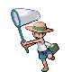

# S.S. Aqua — Trainer Rosters

---

## First Voyage

### Generic Trainers

| Trainer | P1 | P2 | P3 | P4 | P5 | P6 |
|:-------:|:--:|:--:|:--:|:--:|:--:|:--:|
|  Hiker Noland |  [Abomasnow](../../pokemon/abomasnow.md/) Lv. 53 |  [Sudowoodo](../../pokemon/sudowoodo.md/) Lv. 53 |
|  Pokefan Colin |  [Delibird](../../pokemon/delibird.md/) Lv. 55 |
|  Twins Meg & Peg |  [Tropius](../../pokemon/tropius.md/) Lv. 54 |  [Drifblim](../../pokemon/drifblim.md/) Lv. 54 |
|  Firebreather Lyle |  [Typhlosion](../../pokemon/typhlosion.md/) Lv. 55 |
|  Juggler Fritz |  [Mr. Mime](../../pokemon/mr-mime.md/) Lv. 53 |  [Scyther](../../pokemon/scyther.md/) Lv. 53 |  [Jynx](../../pokemon/jynx.md/) Lv. 53 |
|  Sailor Jeff |  [Hariyama](../../pokemon/hariyama.md/) Lv. 54 |  [Golduck](../../pokemon/golduck.md/) Lv. 54 |
|  Sailor Stanly |  [Machamp](../../pokemon/machamp.md/) Lv. 54 |  [Kingdra](../../pokemon/kingdra.md/) Lv. 54 |
|  Picnicker Debra |  [Seaking](../../pokemon/seaking.md/) Lv. 55 |

---

## Vermilion to Olivine

### Generic Trainers

| Trainer | P1 | P2 | P3 | P4 | P5 | P6 |
|:-------:|:--:|:--:|:--:|:--:|:--:|:--:|
|  Pokefan Georgia |  [Furret](../../pokemon/furret.md/) Lv. 51 |  [Ampharos](../../pokemon/ampharos.md/) Lv. 51 |  [Espeon](../../pokemon/espeon.md/) Lv. 51 |  [Meganium](../../pokemon/meganium.md/) Lv. 51 |  [Bellossom](../../pokemon/bellossom.md/) Lv. 51 |
|  Pokefan Jeremy |  [Raichu](../../pokemon/raichu.md/) Lv. 53 |  [Poliwrath](../../pokemon/poliwrath.md/) Lv. 53 |  [Clefable](../../pokemon/clefable.md/) Lv. 53 |
|  Guitarist Clyde |  [Electabuzz](../../pokemon/electabuzz.md/) Lv. 55 |
|  Bug Catcher Ken |  [Ariados](../../pokemon/ariados.md/) Lv. 54 |  [Pinsir](../../pokemon/pinsir.md/) Lv. 54 |
|  Poke Maniac Morgan |  [Rhydon](../../pokemon/rhydon.md/) Lv. 54 |  [Exeggutor](../../pokemon/exeggutor.md/) Lv. 54 |
|  Burglar Corey |  [Magmar](../../pokemon/magmar.md/) Lv. 53 |  [Houndoom](../../pokemon/houndoom.md/) Lv. 53 |  [Weezing](../../pokemon/weezing.md/) Lv. 53 |
|  Sailor Kenneth |  [Kingler](../../pokemon/kingler.md/) Lv. 55 |
|  School Kid Ricky |  [Ambipom](../../pokemon/ambipom.md/) Lv. 54 |  [Dodrio](../../pokemon/dodrio.md/) Lv. 54 |
|  School Kid Nate |  [Butterfree](../../pokemon/butterfree.md/) Lv. 54 |  [Haunter](../../pokemon/haunter.md/) Lv. 54 |
|  Teacher Shirley |  [Mawile](../../pokemon/mawile.md/) Lv. 54 |  [Wigglytuff](../../pokemon/wigglytuff.md/) Lv. 54 |

---

## Olivine to Vermilion

### Generic Trainers

| Trainer | P1 | P2 | P3 | P4 | P5 | P6 |
|:-------:|:--:|:--:|:--:|:--:|:--:|:--:|
|  Super Nerd Shawn |  [Magneton](../../pokemon/magneton.md/) Lv. 53 |  [Muk](../../pokemon/muk.md/) Lv. 53 |  [Zangoose](../../pokemon/zangoose.md/) Lv. 53 |
|  Psychic Rodney |  [Kadabra](../../pokemon/kadabra.md/) Lv. 54 |  [Hypno](../../pokemon/hypno.md/) Lv. 54 |
|  Beauty Cassie |  [Jumpluff](../../pokemon/jumpluff.md/) Lv. 54 |  [Butterfree](../../pokemon/butterfree.md/) Lv. 54 |
|  Ace Trainer Shaye |  [Kangaskhan](../../pokemon/kangaskhan.md/) Lv. 55 |  [Slaking](../../pokemon/slaking.md/) Lv. 55 |  [Tauros](../../pokemon/tauros.md/) Lv. 55 |
|  Ace Trainer Carol |  [Togekiss](../../pokemon/togekiss.md/) Lv. 55 |  [Blissey](../../pokemon/blissey.md/) Lv. 55 |  [Persian](../../pokemon/persian.md/) Lv. 55 |
|  Gentleman Edward |  [Delcatty](../../pokemon/delcatty.md/) Lv. 54 |  [Arcanine](../../pokemon/arcanine.md/) Lv. 54 |
|  Sailor Garrett |  [Kingdra](../../pokemon/kingdra.md/) Lv. 55 |
|  Fisherman Jonah |  [Cloyster](../../pokemon/cloyster.md/) Lv. 52 |  [Sharpedo](../../pokemon/sharpedo.md/) Lv. 52 |  [Octillery](../../pokemon/octillery.md/) Lv. 52 |  [Gastrodon](../../pokemon/gastrodon.md/) Lv. 52 |
|  Black Belt Wai |  [Medicham](../../pokemon/medicham.md/) Lv. 53 |  [Infernape](../../pokemon/infernape.md/) Lv. 53 |  [Breloom](../../pokemon/breloom.md/) Lv. 53 |

