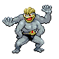

# S.S. Aqua — Trainer Rosters

---

## First Voyage

### Generic Trainers

| Trainer | P1 | P2 | P3 | P4 | P5 | P6 |
|:-------:|:--:|:--:|:--:|:--:|:--:|:--:|
|  Hiker Noland |  Abomasnow Lv. 53 |  Sudowoodo Lv. 53 |
|  Pokefan Colin |  Delibird Lv. 55 |
|  Twins Meg & Peg |  Tropius Lv. 54 |  Drifblim Lv. 54 |
|  Firebreather Lyle |  Typhlosion Lv. 55 |
|  Juggler Fritz |  Mr. Mime Lv. 53 |  Scyther Lv. 53 |  Jynx Lv. 53 |
|  Sailor Jeff |  Hariyama Lv. 54 |  Golduck Lv. 54 |
|  Sailor Stanly |  Machamp Lv. 54 |  Kingdra Lv. 54 |
|  Picnicker Debra |  Seaking Lv. 55 |

---

## Vermilion to Olivine

### Generic Trainers

| Trainer | P1 | P2 | P3 | P4 | P5 | P6 |
|:-------:|:--:|:--:|:--:|:--:|:--:|:--:|
|  Pokefan Georgia |  Furret Lv. 51 |  Ampharos Lv. 51 |  Espeon Lv. 51 |  Meganium Lv. 51 |  Bellossom Lv. 51 |
|  Pokefan Jeremy |  Raichu Lv. 53 |  Poliwrath Lv. 53 |  Clefable Lv. 53 |
|  Guitarist Clyde |  Electabuzz Lv. 55 |
|  Bug Catcher Ken |  Ariados Lv. 54 |  Pinsir Lv. 54 |
|  Poke Maniac Morgan |  Rhydon Lv. 54 |  Exeggutor Lv. 54 |
|  Burglar Corey |  Magmar Lv. 53 |  Houndoom Lv. 53 |  Weezing Lv. 53 |
|  Sailor Kenneth |  Kingler Lv. 55 |
|  School Kid Ricky |  Ambipom Lv. 54 |  Dodrio Lv. 54 |
|  School Kid Nate |  Butterfree Lv. 54 |  Haunter Lv. 54 |
|  Teacher Shirley |  Mawile Lv. 54 |  Wigglytuff Lv. 54 |

---

## Olivine to Vermilion

### Generic Trainers

| Trainer | P1 | P2 | P3 | P4 | P5 | P6 |
|:-------:|:--:|:--:|:--:|:--:|:--:|:--:|
|  Super Nerd Shawn |  Magneton Lv. 53 |  Muk Lv. 53 |  Zangoose Lv. 53 |
|  Psychic Rodney |  Kadabra Lv. 54 |  Hypno Lv. 54 |
|  Beauty Cassie |  Jumpluff Lv. 54 |  Butterfree Lv. 54 |
|  Ace Trainer Shaye |  Kangaskhan Lv. 55 |  Slaking Lv. 55 |  Tauros Lv. 55 |
|  Ace Trainer Carol |  Togekiss Lv. 55 |  Blissey Lv. 55 |  Persian Lv. 55 |
|  Gentleman Edward |  Delcatty Lv. 54 |  Arcanine Lv. 54 |
|  Sailor Garrett |  Kingdra Lv. 55 |
|  Fisherman Jonah |  Cloyster Lv. 52 |  Sharpedo Lv. 52 |  Octillery Lv. 52 |  Gastrodon Lv. 52 |
|  Black Belt Wai |  Medicham Lv. 53 |  Infernape Lv. 53 |  Breloom Lv. 53 |

