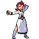

# Team Rocket HQ — Important Trainers

### Executive Petrel

| Pokémon | Attributes | Item | Moves |
|:-------:|------------|:----:|-------|
|  | **Lv. 41** Skuntank **Ability:** Stench   | None | 1. Poison Jab 2. Flamethrower 3. Dig 4. Protect |
|  | **Lv. 41** Raticate **Ability:** Hustle  | None | 1. Super Fang 2. Double-Edge 3. Crunch 4. Quick Attack |
|  | **Lv. 41** Toxicroak **Ability:** Anticipation   | None | 1. Cross Chop 2. Sucker Punch 3. X-Scissor 4. Stone Edge |
|  | **Lv. 41** Crobat **Ability:** Inner Focus   | None | 1. U-Turn 2. Sludge Bomb 3. Attract 4. Aerial Ace |
|  | **Lv. 43** Weezing **Ability:** Levitate  | None | 1. Sludge Bomb 2. Fire Blast 3. Thunder 4. Dark Pulse |

### Executive Ariana

| Pokémon | Attributes | Item | Moves |
|:-------:|------------|:----:|-------|
|  | **Lv. 42** Arbok **Ability:** Intimidate  | None | 1. Earthquake 2. Fire Fang 3. Crunch 4. Thunder Fang |
|  | **Lv. 42** Vileplume **Ability:** Chlorophyll   | None | 1. Giga Drain 2. Growth 3. Sleep Powder 4. Sludge Bomb |
|  | **Lv. 43** Honchkrow **Ability:** Insomnia   | None | 1. Brave Bird 2. Thunder Wave 3. Dark Pulse 4. Night Shade |

