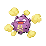
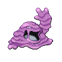
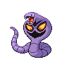
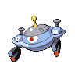
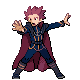

# Team Rocket HQ — Trainer Rosters

### Generic Trainers

| Trainer | P1 | P2 | P3 | P4 | P5 | P6 |
|:-------:|:--:|:--:|:--:|:--:|:--:|:--:|
| ") Team Rocket Grunt (x5) |  Koffing Lv. 37 |  Golbat Lv. 38 |  Primeape Lv. 38 |
| ") Team Rocket Grunt (x5) |  Raticate Lv. 39 |  Muk Lv. 39 |
|  Team Rocket Grunt |  Arbok Lv. 39 |  Magcargo Lv. 39 |
|  Scientist Gregg |  Magnemite Lv. 37 |  Magneton Lv. 37 |  Porygon Lv. 39 |
|  Team Rocket Grunt |  Weepinbell Lv. 39 |  Dustox Lv. 39 |  Venomoth Lv. 40 |
|  Team Rocket Grunt |  Kingler Lv. 40 |  Shelgon Lv. 40 |
|  Scientist Ross |  Koffing Lv. 40 |  Porygon2 Lv. 40 |  Electrode Lv. 40 |  Weezing Lv. 40 |
|  Team Rocket Grunt |  Gloom Lv. 41 |  Cloyster Lv. 41 |
|  Scientist Mitch |  Ditto Lv. 43 |
|  Team Rocket Grunt |  Raticate Lv. 42 |  Bibarel Lv. 42 |
|  Team Rocket Grunt |  Wobbuffet Lv. 42 |
|  Team Rocket Grunt |  Hypno Lv. 41 |  Muk Lv. 41 |  Magnezone Lv. 41 |
|  PKMN Trainer Lance |  Dragonair Lv. 44 |  Aerodactyl Lv. 44 |

### Important Trainers

1. [Executive Petrel](important_trainers.md#executive-petrel)
1. [Executive Ariana](important_trainers.md#executive-ariana)
