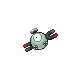

# Trainer Rosters

### Generic Trainers

| Trainer | P1 | P2 | P3 | P4 | P5 | P6 |
|:-------:|:--:|:--:|:--:|:--:|:--:|:--:|
| ") Team Rocket Grunt (x5) |  [Koffing](../../pokemon/koffing.md/) Lv. 37 |  [Golbat](../../pokemon/golbat.md/) Lv. 38 |  [Primeape](../../pokemon/primeape.md/) Lv. 38 |
| ") Team Rocket Grunt (x5) |  [Raticate](../../pokemon/raticate.md/) Lv. 39 |  [Muk](../../pokemon/muk.md/) Lv. 39 |
|  Team Rocket Grunt |  [Arbok](../../pokemon/arbok.md/) Lv. 39 |  [Magcargo](../../pokemon/magcargo.md/) Lv. 39 |
|  Scientist Gregg |  [Magnemite](../../pokemon/magnemite.md/) Lv. 37 |  [Magneton](../../pokemon/magneton.md/) Lv. 37 |  [Porygon](../../pokemon/porygon.md/) Lv. 39 |
|  Team Rocket Grunt |  [Weepinbell](../../pokemon/weepinbell.md/) Lv. 39 |  [Dustox](../../pokemon/dustox.md/) Lv. 39 |  [Venomoth](../../pokemon/venomoth.md/) Lv. 40 |
|  Team Rocket Grunt |  [Kingler](../../pokemon/kingler.md/) Lv. 40 |  [Shelgon](../../pokemon/shelgon.md/) Lv. 40 |
|  Scientist Ross |  [Koffing](../../pokemon/koffing.md/) Lv. 40 |  [Porygon2](../../pokemon/porygon2.md/) Lv. 40 |  [Electrode](../../pokemon/electrode.md/) Lv. 40 |  [Weezing](../../pokemon/weezing.md/) Lv. 40 |
|  Team Rocket Grunt |  [Gloom](../../pokemon/gloom.md/) Lv. 41 |  [Cloyster](../../pokemon/cloyster.md/) Lv. 41 |
|  Scientist Mitch |  [Ditto](../../pokemon/ditto.md/) Lv. 43 |
|  Team Rocket Grunt |  [Raticate](../../pokemon/raticate.md/) Lv. 42 |  [Bibarel](../../pokemon/bibarel.md/) Lv. 42 |
|  Team Rocket Grunt |  [Wobbuffet](../../pokemon/wobbuffet.md/) Lv. 42 |
|  Team Rocket Grunt |  [Hypno](../../pokemon/hypno.md/) Lv. 41 |  [Muk](../../pokemon/muk.md/) Lv. 41 |  [Magnezone](../../pokemon/magnezone.md/) Lv. 41 |
|  PKMN Trainer Lance |  [Dragonair](../../pokemon/dragonair.md/) Lv. 44 |  [Aerodactyl](../../pokemon/aerodactyl.md/) Lv. 44 |

### Important Trainers

1. [Executive Petrel](important_trainers.md#executive-petrel)
1. [Executive Ariana](important_trainers.md#executive-ariana)
