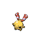

# Tohjo Falls — Wild Pokémon

### Cave

| Sprite | Pokémon | Encounter Type | Level | Chance |
|:------:|---------|:--------------:|-------|--------|
|  | Raticate | {: style="max-width: 24px;"" } | 43 – 45 | 20% |
|  | Azumarill | {: style="max-width: 24px;"" } | 43 – 45 | 20% |
|  | Slowbro | {: style="max-width: 24px;"" } | 43 – 45 | 20% |
|  | Dewgong | {: style="max-width: 24px;"" } | 43 – 45 | 10% |
|  | Golbat | {: style="max-width: 24px;"" } | 43 – 45 | 10% |
|  | Bronzong | {: style="max-width: 24px;"" } | 43 – 45 | 10% |
|  | Quagsire | {: style="max-width: 24px;"" } | 43 – 45 | 10% |

### Meridian Sound

| Sprite | Pokémon | Encounter Type | Level | Chance |
|:------:|---------|:--------------:|-------|--------|
|  | Crobat | {: style="max-width: 24px;"" } | 43 – 45 | 100% |

### Pastoral Sound

| Sprite | Pokémon | Encounter Type | Level | Chance |
|:------:|---------|:--------------:|-------|--------|
|  | Azurill | {: style="max-width: 24px;"" } | 43 – 45 | 50% |
|  | Chingling | {: style="max-width: 24px;"" } | 43 – 45 | 50% |

### Surf

| Sprite | Pokémon | Encounter Type | Level | Chance |
|:------:|---------|:--------------:|-------|--------|
|  | Goldeen | {: style="max-width: 24px;"" } | 43 – 45 | 60% |
|  | Slowpoke | {: style="max-width: 24px;"" } | 43 – 45 | 30% |
|  | Seaking | {: style="max-width: 24px;"" } | 43 – 45 | 10% |

### Old Rod

| Sprite | Pokémon | Encounter Type | Level | Chance |
|:------:|---------|:--------------:|-------|--------|
|  | Magikarp | {: style="max-width: 24px;"" } | 10 | 95% |
|  | Goldeen | {: style="max-width: 24px;"" } | 10 | 5% |

### Good Rod

| Sprite | Pokémon | Encounter Type | Level | Chance |
|:------:|---------|:--------------:|-------|--------|
|  | Magikarp | {: style="max-width: 24px;"" } | 25 | 60% |
|  | Goldeen | {: style="max-width: 24px;"" } | 25 | 40% |

### Super Rod

| Sprite | Pokémon | Encounter Type | Level | Chance |
|:------:|---------|:--------------:|-------|--------|
|  | Goldeen | {: style="max-width: 24px;"" } | 50 | 90% |
|  | Gyarados | {: style="max-width: 24px;"" } | 50 | 7% |
|  | Seaking | {: style="max-width: 24px;"" } | 50 | 3% |

