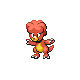
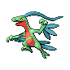
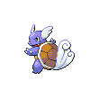
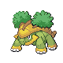

# Trainer Rosters

### Generic Trainers

| Trainer | P1 | P2 | P3 | P4 | P5 | P6 |
|:-------:|:--:|:--:|:--:|:--:|:--:|:--:|
|  Firebreather Ray |  [Vulpix](../../pokemon/vulpix.md/) Lv. 16 |
|  Hiker Daniel |  [Onix](../../pokemon/onix.md/) Lv. 16 |
|  Hiker Russel |  [Geodude](../../pokemon/geodude.md/) Lv. 14 |  [Nosepass](../../pokemon/nosepass.md/) Lv. 15 |
|  Firebreather Bill |  [Koffing](../../pokemon/koffing.md/) Lv. 14 |  [Magby](../../pokemon/magby.md/) Lv. 14 |  [Charmander](../../pokemon/charmander.md/) Lv. 14 |
|  Poke Maniac Larry |  [Slowpoke](../../pokemon/slowpoke.md/) Lv. 15 |  [Cubone](../../pokemon/cubone.md/) Lv. 15 |
|  Hiker Leonard |  [Makuhita](../../pokemon/makuhita.md/) Lv. 26 |  [Hariyama](../../pokemon/hariyama.md/) Lv. 29 |
|  Hiker Phillip |  [Nosepass](../../pokemon/nosepass.md/) Lv. 27 |  [Graveler](../../pokemon/graveler.md/) Lv. 27 |  [Golem](../../pokemon/golem.md/) Lv. 29 |
|  Poke Maniac Andrew |  [Marowak](../../pokemon/marowak.md/) Lv. 29 |  [Lickilicky](../../pokemon/lickilicky.md/) Lv. 29 |
|  Poke Maniac Calvin |  [Kangaskhan](../../pokemon/kangaskhan.md/) Lv. 30 |
|  Ace Trainer Gwen |  [Grovyle](../../pokemon/grovyle.md/) Lv. 30 |  [Marshtomp](../../pokemon/marshtomp.md/) Lv. 30 |  [Combusken](../../pokemon/combusken.md/) Lv. 30 |
|  Ace Trainer Nick |  [Charmeleon](../../pokemon/charmeleon.md/) Lv. 30 |  [Wartortle](../../pokemon/wartortle.md/) Lv. 30 |  [Ivysaur](../../pokemon/ivysaur.md/) Lv. 30 |
|  Ace Trainer Emma |  [Monferno](../../pokemon/monferno.md/) Lv. 30 |  [Prinplup](../../pokemon/prinplup.md/) Lv. 30 |  [Grotle](../../pokemon/grotle.md/) Lv. 30 |

