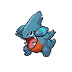

# Union Cave Wild Pokémon

---

## Pastoral Sound

### Cave

| Sprite | Pokémon | Encounter Type | Level | Chance |
|:------:|---------|:--------------:|-------|--------|
|  | Zubat | {: style="max-width: 24px;"" } | 12 – 15 | 25% |
|  | Sandshrew | {: style="max-width: 24px;"" } | 12 – 15 | 25% |
|  | Geodude | {: style="max-width: 24px;"" } | 12 – 15 | 10% |
|  | Whismur | {: style="max-width: 24px;"" } | 12 – 15 | 10% |
|  | Makuhita | {: style="max-width: 24px;"" } | 12 – 15 | 10% |
|  | Machop | {: style="max-width: 24px;"" } | 12 – 15 | 10% |
|  | Aron | {: style="max-width: 24px;"" } | 12 – 15 | 5% |
|  | Cubone | {: style="max-width: 24px;"" } | 12 – 15 | 5% |

### Surf

| Sprite | Pokémon | Encounter Type | Level | Chance |
|:------:|---------|:--------------:|-------|--------|
|  | Wooper | {: style="max-width: 24px;"" } | 12 – 15 | 60% |
|  | Shellos | {: style="max-width: 24px;"" } | 12 – 15 | 30% |
|  | Quagsire | {: style="max-width: 24px;"" } | 12 – 15 | 5% |
|  | Gastrodon | {: style="max-width: 24px;"" } | 12 – 15 | 5% |

### Old Rod

| Sprite | Pokémon | Encounter Type | Level | Chance |
|:------:|---------|:--------------:|-------|--------|
|  | Magikarp | {: style="max-width: 24px;"" } | 10 | 60% |
|  | Goldeen | {: style="max-width: 24px;"" } | 10 | 30% |
|  | Barboach | {: style="max-width: 24px;"" } | 10 | 10% |

### Good Rod

| Sprite | Pokémon | Encounter Type | Level | Chance |
|:------:|---------|:--------------:|-------|--------|
|  | Magikarp | {: style="max-width: 24px;"" } | 25 | 60% |
|  | Goldeen | {: style="max-width: 24px;"" } | 25 | 30% |
|  | Barboach | {: style="max-width: 24px;"" } | 25 | 10% |

### Super Rod

| Sprite | Pokémon | Encounter Type | Level | Chance |
|:------:|---------|:--------------:|-------|--------|
|  | Gyarados | {: style="max-width: 24px;"" } | 50 | 60% |
|  | Seaking | {: style="max-width: 24px;"" } | 50 | 30% |
|  | Whiscash | {: style="max-width: 24px;"" } | 50 | 10% |

### Meridian Sound

| Sprite | Pokémon | Encounter Type | Level | Chance |
|:------:|---------|:--------------:|-------|--------|
|  | Sandslash | {: style="max-width: 24px;"" } | 12 – 15 | 50% |
|  | Loudred | {: style="max-width: 24px;"" } | 12 – 15 | 50% |

### Pastoral Sound

| Sprite | Pokémon | Encounter Type | Level | Chance |
|:------:|---------|:--------------:|-------|--------|
|  | Gible | {: style="max-width: 24px;"" } | 12 – 15 | 100% |

---

## Pastoral Sound

### Cave

| Sprite | Pokémon | Encounter Type | Level | Chance |
|:------:|---------|:--------------:|-------|--------|
|  | Zubat | {: style="max-width: 24px;"" } | 13 – 16 | 25% |
|  | Sandshrew | {: style="max-width: 24px;"" } | 13 – 16 | 20% |
|  | Geodude | {: style="max-width: 24px;"" } | 13 – 16 | 10% |
|  | Bronzor | {: style="max-width: 24px;"" } | 13 – 16 | 10% |
|  | Aron | {: style="max-width: 24px;"" } | 13 – 16 | 10% |
|  | Onix | {: style="max-width: 24px;"" } | 13 – 16 | 15% |
|  | Bagon | {: style="max-width: 24px;"" } | 13 – 16 | 5% |
|  | Gible | {: style="max-width: 24px;"" } | 13 – 16 | 5% |

### Surf

| Sprite | Pokémon | Encounter Type | Level | Chance |
|:------:|---------|:--------------:|-------|--------|
|  | Wooper | {: style="max-width: 24px;"" } | 13 – 16 | 60% |
|  | Shellos | {: style="max-width: 24px;"" } | 13 – 16 | 30% |
|  | Quagsire | {: style="max-width: 24px;"" } | 13 – 16 | 5% |
|  | Gastrodon | {: style="max-width: 24px;"" } | 13 – 16 | 5% |

### Old Rod

| Sprite | Pokémon | Encounter Type | Level | Chance |
|:------:|---------|:--------------:|-------|--------|
|  | Magikarp | {: style="max-width: 24px;"" } | 10 | 60% |
|  | Goldeen | {: style="max-width: 24px;"" } | 10 | 30% |
|  | Barboach | {: style="max-width: 24px;"" } | 10 | 10% |

### Good Rod

| Sprite | Pokémon | Encounter Type | Level | Chance |
|:------:|---------|:--------------:|-------|--------|
|  | Magikarp | {: style="max-width: 24px;"" } | 25 | 60% |
|  | Goldeen | {: style="max-width: 24px;"" } | 25 | 30% |
|  | Barboach | {: style="max-width: 24px;"" } | 25 | 10% |

### Super Rod

| Sprite | Pokémon | Encounter Type | Level | Chance |
|:------:|---------|:--------------:|-------|--------|
|  | Gyarados | {: style="max-width: 24px;"" } | 50 | 60% |
|  | Seaking | {: style="max-width: 24px;"" } | 50 | 30% |
|  | Whiscash | {: style="max-width: 24px;"" } | 50 | 10% |

### Meridian Sound

| Sprite | Pokémon | Encounter Type | Level | Chance |
|:------:|---------|:--------------:|-------|--------|
|  | Golbat | {: style="max-width: 24px;"" } | 13 – 16 | 50% |
|  | Steelix | {: style="max-width: 24px;"" } | 13 – 16 | 50% |

### Pastoral Sound

| Sprite | Pokémon | Encounter Type | Level | Chance |
|:------:|---------|:--------------:|-------|--------|
|  | Cubone | {: style="max-width: 24px;"" } | 13 – 16 | 100% |

---

## Pastoral Sound

### Cave

| Sprite | Pokémon | Encounter Type | Level | Chance |
|:------:|---------|:--------------:|-------|--------|
|  | Golbat | {: style="max-width: 24px;"" } | 28 – 30 | 20% |
|  | Sandslash | {: style="max-width: 24px;"" } | 28 – 30 | 20% |
|  | Graveler | {: style="max-width: 24px;"" } | 28 – 30 | 10% |
|  | Sableye | {: style="max-width: 24px;"" } | 28 – 30 | 10% |
|  | Machoke | {: style="max-width: 24px;"" } | 28 – 30 | 10% |
|  | Loudred | {: style="max-width: 24px;"" } | 28 – 30 | 10% |
|  | Mawile | {: style="max-width: 24px;"" } | 28 – 30 | 10% |
|  | Lickitung | {: style="max-width: 24px;"" } | 28 – 30 | 5% |
|  | Kangaskhan | {: style="max-width: 24px;"" } | 28 – 30 | 5% |

### Surf

| Sprite | Pokémon | Encounter Type | Level | Chance |
|:------:|---------|:--------------:|-------|--------|
|  | Wooper | {: style="max-width: 24px;"" } | 28 – 30 | 60% |
|  | Shellos | {: style="max-width: 24px;"" } | 28 – 30 | 30% |
|  | Quagsire | {: style="max-width: 24px;"" } | 28 – 30 | 5% |
|  | Gastrodon | {: style="max-width: 24px;"" } | 28 – 30 | 5% |

### Old Rod

| Sprite | Pokémon | Encounter Type | Level | Chance |
|:------:|---------|:--------------:|-------|--------|
|  | Magikarp | {: style="max-width: 24px;"" } | 10 | 60% |
|  | Goldeen | {: style="max-width: 24px;"" } | 10 | 30% |
|  | Barboach | {: style="max-width: 24px;"" } | 10 | 10% |

### Good Rod

| Sprite | Pokémon | Encounter Type | Level | Chance |
|:------:|---------|:--------------:|-------|--------|
|  | Magikarp | {: style="max-width: 24px;"" } | 25 | 60% |
|  | Goldeen | {: style="max-width: 24px;"" } | 25 | 30% |
|  | Barboach | {: style="max-width: 24px;"" } | 25 | 10% |

### Super Rod

| Sprite | Pokémon | Encounter Type | Level | Chance |
|:------:|---------|:--------------:|-------|--------|
|  | Gyarados | {: style="max-width: 24px;"" } | 50 | 60% |
|  | Seaking | {: style="max-width: 24px;"" } | 50 | 30% |
|  | Whiscash | {: style="max-width: 24px;"" } | 50 | 10% |

### Meridian Sound

| Sprite | Pokémon | Encounter Type | Level | Chance |
|:------:|---------|:--------------:|-------|--------|
|  | Lickilicky | {: style="max-width: 24px;"" } | 28 – 30 | 50% |
|  | ExploudPastoral | {: style="max-width: 24px;"" } | 28 – 30 | 50% |

### Pastoral Sound

| Sprite | Pokémon | Encounter Type | Level | Chance |
|:------:|---------|:--------------:|-------|--------|
|  | Kangaskhan | {: style="max-width: 24px;"" } | 28 – 30 | 100% |

