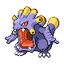

# Union Cave — Wild Pokémon

---

## Pastoral Sound

### Cave

| Sprite | Pokémon | Encounter Type | Level | Chance |
|:------:|---------|:--------------:|-------|--------|
|  | [Zubat](../../pokemon/zubat.md) | encounter_sprites| 12 – 15 | 25% |
|  | [Sandshrew](../../pokemon/sandshrew.md) | encounter_sprites| 12 – 15 | 25% |
|  | [Geodude](../../pokemon/geodude.md) | encounter_sprites| 12 – 15 | 10% |
|  | [Whismur](../../pokemon/whismur.md) | encounter_sprites| 12 – 15 | 10% |
|  | [Makuhita](../../pokemon/makuhita.md) | encounter_sprites| 12 – 15 | 10% |
|  | [Machop](../../pokemon/machop.md) | encounter_sprites| 12 – 15 | 10% |
|  | [Aron](../../pokemon/aron.md) | encounter_sprites| 12 – 15 | 5% |
|  | [Cubone](../../pokemon/cubone.md) | encounter_sprites| 12 – 15 | 5% |

### Surf

| Sprite | Pokémon | Encounter Type | Level | Chance |
|:------:|---------|:--------------:|-------|--------|
|  | [Wooper](../../pokemon/wooper.md) | encounter_sprites| 12 – 15 | 60% |
|  | [Shellos](../../pokemon/shellos.md) | encounter_sprites| 12 – 15 | 30% |
|  | [Quagsire](../../pokemon/quagsire.md) | encounter_sprites| 12 – 15 | 5% |
|  | [Gastrodon](../../pokemon/gastrodon.md) | encounter_sprites| 12 – 15 | 5% |

### Old Rod

| Sprite | Pokémon | Encounter Type | Level | Chance |
|:------:|---------|:--------------:|-------|--------|
|  | [Magikarp](../../pokemon/magikarp.md) | encounter_sprites| 10 | 60% |
|  | [Goldeen](../../pokemon/goldeen.md) | encounter_sprites| 10 | 30% |
|  | [Barboach](../../pokemon/barboach.md) | encounter_sprites| 10 | 10% |

### Good Rod

| Sprite | Pokémon | Encounter Type | Level | Chance |
|:------:|---------|:--------------:|-------|--------|
|  | [Magikarp](../../pokemon/magikarp.md) | encounter_sprites| 25 | 60% |
|  | [Goldeen](../../pokemon/goldeen.md) | encounter_sprites| 25 | 30% |
|  | [Barboach](../../pokemon/barboach.md) | encounter_sprites| 25 | 10% |

### Super Rod

| Sprite | Pokémon | Encounter Type | Level | Chance |
|:------:|---------|:--------------:|-------|--------|
|  | [Gyarados](../../pokemon/gyarados.md) | encounter_sprites| 50 | 60% |
|  | [Seaking](../../pokemon/seaking.md) | encounter_sprites| 50 | 30% |
|  | [Whiscash](../../pokemon/whiscash.md) | encounter_sprites| 50 | 10% |

### Meridian Sound

| Sprite | Pokémon | Encounter Type | Level | Chance |
|:------:|---------|:--------------:|-------|--------|
|  | [Sandslash](../../pokemon/sandslash.md) | encounter_sprites| 12 – 15 | 50% |
|  | [Loudred](../../pokemon/loudred.md) | encounter_sprites| 12 – 15 | 50% |

### Pastoral Sound

| Sprite | Pokémon | Encounter Type | Level | Chance |
|:------:|---------|:--------------:|-------|--------|
|  | [Gible](../../pokemon/gible.md) | encounter_sprites| 12 – 15 | 100% |

---

## Pastoral Sound

### Cave

| Sprite | Pokémon | Encounter Type | Level | Chance |
|:------:|---------|:--------------:|-------|--------|
|  | [Zubat](../../pokemon/zubat.md) | encounter_sprites| 13 – 16 | 25% |
|  | [Sandshrew](../../pokemon/sandshrew.md) | encounter_sprites| 13 – 16 | 20% |
|  | [Geodude](../../pokemon/geodude.md) | encounter_sprites| 13 – 16 | 10% |
|  | [Bronzor](../../pokemon/bronzor.md) | encounter_sprites| 13 – 16 | 10% |
|  | [Aron](../../pokemon/aron.md) | encounter_sprites| 13 – 16 | 10% |
|  | [Onix](../../pokemon/onix.md) | encounter_sprites| 13 – 16 | 15% |
|  | [Bagon](../../pokemon/bagon.md) | encounter_sprites| 13 – 16 | 5% |
|  | [Gible](../../pokemon/gible.md) | encounter_sprites| 13 – 16 | 5% |

### Surf

| Sprite | Pokémon | Encounter Type | Level | Chance |
|:------:|---------|:--------------:|-------|--------|
|  | [Wooper](../../pokemon/wooper.md) | encounter_sprites| 13 – 16 | 60% |
|  | [Shellos](../../pokemon/shellos.md) | encounter_sprites| 13 – 16 | 30% |
|  | [Quagsire](../../pokemon/quagsire.md) | encounter_sprites| 13 – 16 | 5% |
|  | [Gastrodon](../../pokemon/gastrodon.md) | encounter_sprites| 13 – 16 | 5% |

### Old Rod

| Sprite | Pokémon | Encounter Type | Level | Chance |
|:------:|---------|:--------------:|-------|--------|
|  | [Magikarp](../../pokemon/magikarp.md) | encounter_sprites| 10 | 60% |
|  | [Goldeen](../../pokemon/goldeen.md) | encounter_sprites| 10 | 30% |
|  | [Barboach](../../pokemon/barboach.md) | encounter_sprites| 10 | 10% |

### Good Rod

| Sprite | Pokémon | Encounter Type | Level | Chance |
|:------:|---------|:--------------:|-------|--------|
|  | [Magikarp](../../pokemon/magikarp.md) | encounter_sprites| 25 | 60% |
|  | [Goldeen](../../pokemon/goldeen.md) | encounter_sprites| 25 | 30% |
|  | [Barboach](../../pokemon/barboach.md) | encounter_sprites| 25 | 10% |

### Super Rod

| Sprite | Pokémon | Encounter Type | Level | Chance |
|:------:|---------|:--------------:|-------|--------|
|  | [Gyarados](../../pokemon/gyarados.md) | encounter_sprites| 50 | 60% |
|  | [Seaking](../../pokemon/seaking.md) | encounter_sprites| 50 | 30% |
|  | [Whiscash](../../pokemon/whiscash.md) | encounter_sprites| 50 | 10% |

### Meridian Sound

| Sprite | Pokémon | Encounter Type | Level | Chance |
|:------:|---------|:--------------:|-------|--------|
|  | [Golbat](../../pokemon/golbat.md) | encounter_sprites| 13 – 16 | 50% |
|  | [Steelix](../../pokemon/steelix.md) | encounter_sprites| 13 – 16 | 50% |

### Pastoral Sound

| Sprite | Pokémon | Encounter Type | Level | Chance |
|:------:|---------|:--------------:|-------|--------|
|  | [Cubone](../../pokemon/cubone.md) | encounter_sprites| 13 – 16 | 100% |

---

## Pastoral Sound

### Cave

| Sprite | Pokémon | Encounter Type | Level | Chance |
|:------:|---------|:--------------:|-------|--------|
|  | [Golbat](../../pokemon/golbat.md) | encounter_sprites| 28 – 30 | 20% |
|  | [Sandslash](../../pokemon/sandslash.md) | encounter_sprites| 28 – 30 | 20% |
|  | [Graveler](../../pokemon/graveler.md) | encounter_sprites| 28 – 30 | 10% |
|  | [Sableye](../../pokemon/sableye.md) | encounter_sprites| 28 – 30 | 10% |
|  | [Machoke](../../pokemon/machoke.md) | encounter_sprites| 28 – 30 | 10% |
|  | [Loudred](../../pokemon/loudred.md) | encounter_sprites| 28 – 30 | 10% |
|  | [Mawile](../../pokemon/mawile.md) | encounter_sprites| 28 – 30 | 10% |
|  | [Lickitung](../../pokemon/lickitung.md) | encounter_sprites| 28 – 30 | 5% |
|  | [Kangaskhan](../../pokemon/kangaskhan.md) | encounter_sprites| 28 – 30 | 5% |

### Surf

| Sprite | Pokémon | Encounter Type | Level | Chance |
|:------:|---------|:--------------:|-------|--------|
|  | [Wooper](../../pokemon/wooper.md) | encounter_sprites| 28 – 30 | 60% |
|  | [Shellos](../../pokemon/shellos.md) | encounter_sprites| 28 – 30 | 30% |
|  | [Quagsire](../../pokemon/quagsire.md) | encounter_sprites| 28 – 30 | 5% |
|  | [Gastrodon](../../pokemon/gastrodon.md) | encounter_sprites| 28 – 30 | 5% |

### Old Rod

| Sprite | Pokémon | Encounter Type | Level | Chance |
|:------:|---------|:--------------:|-------|--------|
|  | [Magikarp](../../pokemon/magikarp.md) | encounter_sprites| 10 | 60% |
|  | [Goldeen](../../pokemon/goldeen.md) | encounter_sprites| 10 | 30% |
|  | [Barboach](../../pokemon/barboach.md) | encounter_sprites| 10 | 10% |

### Good Rod

| Sprite | Pokémon | Encounter Type | Level | Chance |
|:------:|---------|:--------------:|-------|--------|
|  | [Magikarp](../../pokemon/magikarp.md) | encounter_sprites| 25 | 60% |
|  | [Goldeen](../../pokemon/goldeen.md) | encounter_sprites| 25 | 30% |
|  | [Barboach](../../pokemon/barboach.md) | encounter_sprites| 25 | 10% |

### Super Rod

| Sprite | Pokémon | Encounter Type | Level | Chance |
|:------:|---------|:--------------:|-------|--------|
|  | [Gyarados](../../pokemon/gyarados.md) | encounter_sprites| 50 | 60% |
|  | [Seaking](../../pokemon/seaking.md) | encounter_sprites| 50 | 30% |
|  | [Whiscash](../../pokemon/whiscash.md) | encounter_sprites| 50 | 10% |

### Meridian Sound

| Sprite | Pokémon | Encounter Type | Level | Chance |
|:------:|---------|:--------------:|-------|--------|
|  | [Lickilicky](../../pokemon/lickilicky.md) | encounter_sprites| 28 – 30 | 50% |
|  | [Exploud](../../pokemon/exploud.md) | encounter_sprites| 28 – 30 | 50% |

### Pastoral Sound

| Sprite | Pokémon | Encounter Type | Level | Chance |
|:------:|---------|:--------------:|-------|--------|
|  | [Kangaskhan](../../pokemon/kangaskhan.md) | encounter_sprites| 28 – 30 | 100% |

