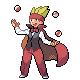

# Trainer Rosters

---

## Gym

### Generic Trainers

| Trainer | P1 | P2 | P3 | P4 | P5 | P6 |
|:-------:|:--:|:--:|:--:|:--:|:--:|:--:|
|  Juggler Horton |  Rotom(H) Lv. 57 |  Rotom(W) Lv. 57 |  Rotom(Fr) Lv. 57 |  Rotom(F) Lv. 57 |  Rotom(M) Lv. 57 |
|  Guitarist Vincent |  Electabuzz Lv. 59 |  Electrode Lv. 59 |  Magneton Lv. 59 |
|  Gentleman Gregory |  Manectric Lv. 60 |  Luxray Lv. 60 |

### Important Trainers

1. [Leader Lt. Surge](important_trainers.md#leader-lt-surge)
