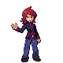
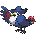
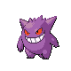
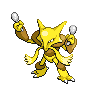
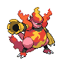

# Victory Road — Important Trainers

### Rival Silver

=== "Totodile"

	| Pokémon | Attributes | Item | Moves |
	|:-------:|------------|:----:|-------|
	| | **Lv. 50** [Honchkrow](../../pokemon/honchkrow.md/) **Ability:** Insomnia   | None | 1. Drill Peck 2. Dark Pulse 3. Nasty Plot 4. Heat Wave |
	| | **Lv. 49** [Gengar](../../pokemon/gengar.md/) **Ability:** Levitate   | None | 1. Shadow Ball 2. Thunderbolt 3. Destiny Bond 4. Energy Ball |
	| | **Lv. 50** [Alakazam](../../pokemon/alakazam.md/) **Ability:** Synchronize  | None | 1. Psychic 2. Recover 3. Energy Ball 4. Focus Blast |
	| | **Lv. 51** [Magmortar](../../pokemon/magmortar.md/) **Ability:** Flame Body  | None | 1. Fire Blast 2. Swagger 3. Thunderbolt 4. Focus Blast |
	| | **Lv. 51** [Kingdra](../../pokemon/kingdra.md/) **Ability:** Swift Swim   | None | 1. Hydro Pump 2. Yawn 3. Dragon Pulse 4. Ice Beam |
	| | **Lv. 51** [Magmortar](../../pokemon/magmortar.md/) **Ability:** Flame Body  | None | 1. Fire Blast 2. Swagger 3. Thunderbolt 4. Focus Blast |
	| | **Lv. 53** [Meganium](../../pokemon/meganium.md/) **Ability:** Overgrow  | None | 1. Swords Dance 2. Reflect 3. Seed Bomb 4. Earthquake |
	
=== "Chikorita"

	| Pokémon | Attributes | Item | Moves |
	|:-------:|------------|:----:|-------|
	| | **Lv. 50** [Honchkrow](../../pokemon/honchkrow.md/) **Ability:** Insomnia   | None | 1. Drill Peck 2. Dark Pulse 3. Nasty Plot 4. Heat Wave |
	| | **Lv. 49** [Gengar](../../pokemon/gengar.md/) **Ability:** Levitate   | None | 1. Shadow Ball 2. Thunderbolt 3. Destiny Bond 4. Energy Ball |
	| | **Lv. 50** [Alakazam](../../pokemon/alakazam.md/) **Ability:** Synchronize  | None | 1. Psychic 2. Recover 3. Energy Ball 4. Focus Blast |
	| | **Lv. 51** [Magmortar](../../pokemon/magmortar.md/) **Ability:** Flame Body  | None | 1. Fire Blast 2. Swagger 3. Thunderbolt 4. Focus Blast |
	| | **Lv. 51** [Kingdra](../../pokemon/kingdra.md/) **Ability:** Swift Swim   | None | 1. Hydro Pump 2. Yawn 3. Dragon Pulse 4. Ice Beam |
	| | **Lv. 51** [Electivire](../../pokemon/electivire.md/) **Ability:** Motor Drive   | None | 1. Thunder 2. Ice Punch 3. Earthquake 4. Light Screen |
	| | **Lv. 53** [Typhlosion](../../pokemon/typhlosion.md/) **Ability:** Blaze  | None | 1. Fire Blast 2. Focus Blast 3. Thunder Punch 4. Low Kick |
	
=== "Cyndaquil"

	| Pokémon | Attributes | Item | Moves |
	|:-------:|------------|:----:|-------|
	| | **Lv. 50** [Honchkrow](../../pokemon/honchkrow.md/) **Ability:** Insomnia   | None | 1. Drill Peck 2. Dark Pulse 3. Nasty Plot 4. Heat Wave |
	| | **Lv. 49** [Gengar](../../pokemon/gengar.md/) **Ability:** Levitate   | None | 1. Shadow Ball 2. Thunderbolt 3. Destiny Bond 4. Energy Ball |
	| | **Lv. 50** [Alakazam](../../pokemon/alakazam.md/) **Ability:** Synchronize  | None | 1. Psychic 2. Recover 3. Energy Ball 4. Focus Blast |
	| | **Lv. 51** [Magmortar](../../pokemon/magmortar.md/) **Ability:** Flame Body  | None | 1. Fire Blast 2. Swagger 3. Thunderbolt 4. Focus Blast |
	| | **Lv. 51** [Magmortar](../../pokemon/magmortar.md/) **Ability:** Flame Body  | None | 1. Fire Blast 2. Swagger 3. Thunderbolt 4. Focus Blast |
	| | **Lv. 51** [Electivire](../../pokemon/electivire.md/) **Ability:** Motor Drive   | None | 1. Thunder 2. Ice Punch 3. Earthquake 4. Light Screen |
	| | **Lv. 53** [Feraligatr](../../pokemon/feraligatr.md/) **Ability:** Torrent  | None | 1. Waterfall 2. Crunch 3. Ice Fang 4. Earthquake |
	
