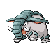
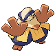
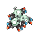
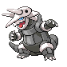
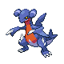

# Victory Road — Wild Pokémon

---

## Super Rod

### Cave

| Sprite | Pokémon | Encounter Type | Level | Chance |
|:------:|---------|:--------------:|-------|--------|
|  | [Golbat](../../pokemon/golbat.md) | {: style="max-width: 24px;"" }| 44 – 46 | 20% |
|  | [Graveler](../../pokemon/graveler.md) | {: style="max-width: 24px;"" }| 44 – 46 | 20% |
|  | [Rhydon](../../pokemon/rhydon.md) | {: style="max-width: 24px;"" }| 44 – 46 | 10% |
|  | [Ursaring](../../pokemon/ursaring.md) | {: style="max-width: 24px;"" }| 44 – 46 | 10% |
|  | [Donphan](../../pokemon/donphan.md) | {: style="max-width: 24px;"" }| 44 – 46 | 10% |
|  | [Marowak](../../pokemon/marowak.md) | {: style="max-width: 24px;"" }| 44 – 46 | 10% |
|  | [Steelix](../../pokemon/steelix.md) | {: style="max-width: 24px;"" }| 44 – 46 | 10% |
|  | [Bronzong](../../pokemon/bronzong.md) | {: style="max-width: 24px;"" }| 44 – 46 | 10% |

### Meridian Sound

| Sprite | Pokémon | Encounter Type | Level | Chance |
|:------:|---------|:--------------:|-------|--------|
|  | [Crobat](../../pokemon/crobat.md) | {: style="max-width: 24px;"" }| 44 – 46 | 50% |
|  | [Golem](../../pokemon/golem.md) | {: style="max-width: 24px;"" }| 44 – 46 | 50% |

### Pastoral Sound

| Sprite | Pokémon | Encounter Type | Level | Chance |
|:------:|---------|:--------------:|-------|--------|
|  | [Chimecho](../../pokemon/chimecho.md) | {: style="max-width: 24px;"" }| 44 – 46 | 50% |
|  | [Marowak](../../pokemon/marowak.md) | {: style="max-width: 24px;"" }| 44 – 46 | 50% |

---

## Pastoral Sound

### Cave

| Sprite | Pokémon | Encounter Type | Level | Chance |
|:------:|---------|:--------------:|-------|--------|
|  | [Machoke](../../pokemon/machoke.md) | {: style="max-width: 24px;"" }| 44 – 46 | 20% |
|  | [Hariyama](../../pokemon/hariyama.md) | {: style="max-width: 24px;"" }| 44 – 46 | 20% |
|  | [Golbat](../../pokemon/golbat.md) | {: style="max-width: 24px;"" }| 44 – 46 | 10% |
|  | [Lairon](../../pokemon/lairon.md) | {: style="max-width: 24px;"" }| 44 – 46 | 10% |
|  | [Loudred](../../pokemon/loudred.md) | {: style="max-width: 24px;"" }| 44 – 46 | 10% |
|  | [Graveler](../../pokemon/graveler.md) | {: style="max-width: 24px;"" }| 44 – 46 | 10% |
|  | [Medicham](../../pokemon/medicham.md) | {: style="max-width: 24px;"" }| 44 – 46 | 5% |
|  | [Magneton](../../pokemon/magneton.md) | {: style="max-width: 24px;"" }| 44 – 46 | 5% |
|  | [Venomoth](../../pokemon/venomoth.md) | {: style="max-width: 24px;"" }| 44 – 46 | 5% |
|  | [Kadabra](../../pokemon/kadabra.md) | {: style="max-width: 24px;"" }| 44 – 46 | 5% |

### Meridian Sound

| Sprite | Pokémon | Encounter Type | Level | Chance |
|:------:|---------|:--------------:|-------|--------|
|  | [Exploud](../../pokemon/exploud.md) | {: style="max-width: 24px;"" }| 44 – 46 | 50% |
|  | [Aggron](../../pokemon/aggron.md) | {: style="max-width: 24px;"" }| 44 – 46 | 50% |

### Pastoral Sound

| Sprite | Pokémon | Encounter Type | Level | Chance |
|:------:|---------|:--------------:|-------|--------|
|  | [Chimecho](../../pokemon/chimecho.md) | {: style="max-width: 24px;"" }| 44 – 46 | 50% |
|  | [Marowak](../../pokemon/marowak.md) | {: style="max-width: 24px;"" }| 44 – 46 | 50% |

---

## Pastoral Sound

### Cave

| Sprite | Pokémon | Encounter Type | Level | Chance |
|:------:|---------|:--------------:|-------|--------|
|  | [Donphan](../../pokemon/donphan.md) | {: style="max-width: 24px;"" }| 45 – 46 | 20% |
|  | [Ursaring](../../pokemon/ursaring.md) | {: style="max-width: 24px;"" }| 45 – 46 | 20% |
|  | [Golbat](../../pokemon/golbat.md) | {: style="max-width: 24px;"" }| 45 – 46 | 10% |
|  | [Lairon](../../pokemon/lairon.md) | {: style="max-width: 24px;"" }| 45 – 46 | 10% |
|  | [Mawile](../../pokemon/mawile.md) | {: style="max-width: 24px;"" }| 45 – 46 | 10% |
|  | [Sableye](../../pokemon/sableye.md) | {: style="max-width: 24px;"" }| 45 – 46 | 10% |
|  | [Gabite](../../pokemon/gabite.md) | {: style="max-width: 24px;"" }| 45 – 46 | 5% |
|  | [Magneton](../../pokemon/magneton.md) | {: style="max-width: 24px;"" }| 45 – 46 | 5% |
|  | [Metang](../../pokemon/metang.md) | {: style="max-width: 24px;"" }| 45 – 46 | 5% |
|  | [Kadabra](../../pokemon/kadabra.md) | {: style="max-width: 24px;"" }| 45 – 46 | 5% |

### Rock Smash

| Sprite | Pokémon | Encounter Type | Level | Chance |
|:------:|---------|:--------------:|-------|--------|
|  | [Graveler](../../pokemon/graveler.md) | {: style="max-width: 24px;"" }| 45 – 46 | 90% |
|  | [Nosepass](../../pokemon/nosepass.md) | {: style="max-width: 24px;"" }| 45 – 46 | 10% |

### Meridian Sound

| Sprite | Pokémon | Encounter Type | Level | Chance |
|:------:|---------|:--------------:|-------|--------|
|  | [Alakazam](../../pokemon/alakazam.md) | {: style="max-width: 24px;"" }| 45 – 46 | 50% |
|  | [Aggron](../../pokemon/aggron.md) | {: style="max-width: 24px;"" }| 45 – 46 | 50% |

### Pastoral Sound

| Sprite | Pokémon | Encounter Type | Level | Chance |
|:------:|---------|:--------------:|-------|--------|
|  | [Chimecho](../../pokemon/chimecho.md) | {: style="max-width: 24px;"" }| 45 – 46 | 50% |
|  | [Marowak](../../pokemon/marowak.md) | {: style="max-width: 24px;"" }| 45 – 46 | 50% |

