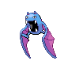
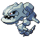

# Victory Road Wild Pokémon

---

## Super Rod

### Cave

| Sprite | Pokémon | Encounter Type | Level | Chance |
|:------:|---------|:--------------:|-------|--------|
|  | Golbat | {: style="max-width: 24px;"" } | 44 – 46 | 20% |
|  | Graveler | {: style="max-width: 24px;"" } | 44 – 46 | 20% |
|  | Rhydon | {: style="max-width: 24px;"" } | 44 – 46 | 10% |
|  | Ursaring | {: style="max-width: 24px;"" } | 44 – 46 | 10% |
|  | Donphan | {: style="max-width: 24px;"" } | 44 – 46 | 10% |
|  | Marowak | {: style="max-width: 24px;"" } | 44 – 46 | 10% |
|  | Steelix | {: style="max-width: 24px;"" } | 44 – 46 | 10% |
|  | Bronzong | {: style="max-width: 24px;"" } | 44 – 46 | 10% |

### Meridian Sound

| Sprite | Pokémon | Encounter Type | Level | Chance |
|:------:|---------|:--------------:|-------|--------|
|  | Crobat | {: style="max-width: 24px;"" } | 44 – 46 | 50% |
|  | Golem | {: style="max-width: 24px;"" } | 44 – 46 | 50% |

### Pastoral Sound

| Sprite | Pokémon | Encounter Type | Level | Chance |
|:------:|---------|:--------------:|-------|--------|
|  | Chimecho | {: style="max-width: 24px;"" } | 44 – 46 | 50% |
|  | Marowak | {: style="max-width: 24px;"" } | 44 – 46 | 50% |

---

## Pastoral Sound

### Cave

| Sprite | Pokémon | Encounter Type | Level | Chance |
|:------:|---------|:--------------:|-------|--------|
|  | Machoke | {: style="max-width: 24px;"" } | 44 – 46 | 20% |
|  | Hariyama | {: style="max-width: 24px;"" } | 44 – 46 | 20% |
|  | Golbat | {: style="max-width: 24px;"" } | 44 – 46 | 10% |
|  | Lairon | {: style="max-width: 24px;"" } | 44 – 46 | 10% |
|  | Loudred | {: style="max-width: 24px;"" } | 44 – 46 | 10% |
|  | Graveler | {: style="max-width: 24px;"" } | 44 – 46 | 10% |
|  | Medicham | {: style="max-width: 24px;"" } | 44 – 46 | 5% |
|  | Magneton | {: style="max-width: 24px;"" } | 44 – 46 | 5% |
|  | Venomoth | {: style="max-width: 24px;"" } | 44 – 46 | 5% |
|  | Kadabra | {: style="max-width: 24px;"" } | 44 – 46 | 5% |

### Meridian Sound

| Sprite | Pokémon | Encounter Type | Level | Chance |
|:------:|---------|:--------------:|-------|--------|
|  | Exploud | {: style="max-width: 24px;"" } | 44 – 46 | 50% |
|  | Aggron | {: style="max-width: 24px;"" } | 44 – 46 | 50% |

### Pastoral Sound

| Sprite | Pokémon | Encounter Type | Level | Chance |
|:------:|---------|:--------------:|-------|--------|
|  | Chimecho | {: style="max-width: 24px;"" } | 44 – 46 | 50% |
|  | Marowak | {: style="max-width: 24px;"" } | 44 – 46 | 50% |

---

## Pastoral Sound

### Cave

| Sprite | Pokémon | Encounter Type | Level | Chance |
|:------:|---------|:--------------:|-------|--------|
|  | Donphan | {: style="max-width: 24px;"" } | 45 – 46 | 20% |
|  | Ursaring | {: style="max-width: 24px;"" } | 45 – 46 | 20% |
|  | Golbat | {: style="max-width: 24px;"" } | 45 – 46 | 10% |
|  | Lairon | {: style="max-width: 24px;"" } | 45 – 46 | 10% |
|  | Mawile | {: style="max-width: 24px;"" } | 45 – 46 | 10% |
|  | Sableye | {: style="max-width: 24px;"" } | 45 – 46 | 10% |
|  | Gabite | {: style="max-width: 24px;"" } | 45 – 46 | 5% |
|  | Magneton | {: style="max-width: 24px;"" } | 45 – 46 | 5% |
|  | Metang | {: style="max-width: 24px;"" } | 45 – 46 | 5% |
|  | Kadabra | {: style="max-width: 24px;"" } | 45 – 46 | 5% |

### Rock Smash

| Sprite | Pokémon | Encounter Type | Level | Chance |
|:------:|---------|:--------------:|-------|--------|
|  | Graveler | {: style="max-width: 24px;"" } | 45 – 46 | 90% |
|  | Nosepass | {: style="max-width: 24px;"" } | 45 – 46 | 10% |

### Meridian Sound

| Sprite | Pokémon | Encounter Type | Level | Chance |
|:------:|---------|:--------------:|-------|--------|
|  | Alakazam | {: style="max-width: 24px;"" } | 45 – 46 | 50% |
|  | Aggron | {: style="max-width: 24px;"" } | 45 – 46 | 50% |

### Pastoral Sound

| Sprite | Pokémon | Encounter Type | Level | Chance |
|:------:|---------|:--------------:|-------|--------|
|  | Chimecho | {: style="max-width: 24px;"" } | 45 – 46 | 50% |
|  | Marowak | {: style="max-width: 24px;"" } | 45 – 46 | 50% |

