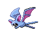

# Trainer Rosters

---

## Gym

### Generic Trainers

| Trainer | P1 | P2 | P3 | P4 | P5 | P6 |
|:-------:|:--:|:--:|:--:|:--:|:--:|:--:|
|  Bird Keeper Abe |  Spearow Lv. 11 |  Pidgey Lv. 11 |  Doduo Lv. 11 |
|  Bird Keeper Rod |  Tailow Lv. 11 |  Wingull Lv. 11 |  Natu Lv. 11 |  Zubat Lv. 11 |

### Important Trainers

1. [Leader Falkner](important_trainers.md#leader-falkner)
