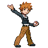
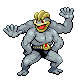

# Viridian City — Important Trainers

---

## Gym

### Leader Blue

| Pokémon | Attributes | Item | Moves |
|:-------:|------------|:----:|-------|
|  | **Lv. 68** Nidoqueen **Ability:** Poison Point   | None | 1. Earthquake 2. Roar 3. Crunch 4. Toxic Spikes |
|  | **Lv. 66** Gyarados **Ability:** Intimidate   | None | 1. Earthquake 2. Aqua Tail 3. Dragon Dance 4. Bounce |
|  | **Lv. 66** Exeggutor **Ability:** Chlorophyll   | None | 1. Leaf Storm 2. Trick Room 3. Sleep Powder 4. Psychic |
|  | **Lv. 68** Rhyperior **Ability:** Solid Rock   | None | 1. Megahorn 2. Stone Edge 3. Thunder Fang 4. Earthquake |
|  | **Lv. 68** Machamp **Ability:** No Guard  | None | 1. Dynamic Punch 2. Ice Punch 3. Stone Edge 4. Fire Punch |
|  | **Lv. 70** Tyranitar **Ability:** Sand Stream   |  Sitrus Berry | 1. Stone Edge 2. Crunch 3. Earthquake 4. Thunder |

