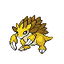
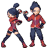

# Viridian City — Trainer Rosters

---

## Gym

### Generic Trainers

| Trainer | P1 | P2 | P3 | P4 | P5 | P6 |
|:-------:|:--:|:--:|:--:|:--:|:--:|:--:|
|  Ace Trainer Arabella |  Dugtrio Lv. 66 |  Nidoqueen Lv. 66 |  Quagsire Lv. 66 |
|  Ace Trainer Salma |  Sandslash Lv. 66 |  Steelix Lv. 66 |  Mamoswine Lv. 66 |
|  Ace Trainer Bonita |  Donphan Lv. 67 |  Flygon Lv. 67 |
|  Double Team Elan & Ida |  Hippowdon Lv. 68 |  Claydol Lv. 68 |

### Important Trainers

1. [Leader Blue](important_trainers.md#leader-blue)
