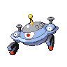

# Trainer Rosters

### Generic Trainers

| Trainer | P1 | P2 | P3 | P4 | P5 | P6 |
|:-------:|:--:|:--:|:--:|:--:|:--:|:--:|
|  Ace Trainer Cheria |  [Tropius](../../pokemon/tropius.md/) Lv. 75 |  [Manectric](../../pokemon/manectric.md/) Lv. 75 |  [Swampert](../../pokemon/swampert.md/) Lv. 75 |  [Togekiss](../../pokemon/togekiss.md/) Lv. 75 |  [Flygon](../../pokemon/flygon.md/) Lv. 75 |
|  Ace Trainer Donnie |  [Rapidash](../../pokemon/rapidash.md/) Lv. 75 |  [Metagross](../../pokemon/metagross.md/) Lv. 75 |  [Snorlax](../../pokemon/snorlax.md/) Lv. 75 |  [Ludicolo](../../pokemon/ludicolo.md/) Lv. 75 |  [Yanmega](../../pokemon/yanmega.md/) Lv. 75 |
|  Ace Trainer Richard |  [Roserade](../../pokemon/roserade.md/) Lv. 75 |  [Magnezone](../../pokemon/magnezone.md/) Lv. 75 |  [Gardevoir](../../pokemon/gardevoir.md/) Lv. 75 |  [Kingdra](../../pokemon/kingdra.md/) Lv. 75 |  [Houndoom](../../pokemon/houndoom.md/) Lv. 75 |
|  Ace Trainer Eliza |  [Sharpedo](../../pokemon/sharpedo.md/) Lv. 75 |  [Sudowoodo](../../pokemon/sudowoodo.md/) Lv. 75 |  [Blissey](../../pokemon/blissey.md/) Lv. 75 |  [Dusknoir](../../pokemon/dusknoir.md/) Lv. 75 |  [Scizor](../../pokemon/scizor.md/) Lv. 75 |
|  Ace Trainer Abner |  [Miltank](../../pokemon/miltank.md/) Lv. 75 |  [Aerodactyl](../../pokemon/aerodactyl.md/) Lv. 75 |  [Drifblim](../../pokemon/drifblim.md/) Lv. 75 |  [Gastrodon](../../pokemon/gastrodon.md/) Lv. 75 |  [Exeggutor](../../pokemon/exeggutor.md/) Lv. 75 |

