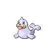

# Whirl Islands — Wild Pokémon

---

## Super Rod

### Cave

| Sprite | Pokémon | Encounter Type | Level | Chance |
|:------:|---------|:--------------:|-------|--------|
|  | Krabby | {: style="max-width: 24px;"" } | 34 – 36 | 20% |
|  | Seel | {: style="max-width: 24px;"" } | 34 – 36 | 20% |
|  | Psyduck | {: style="max-width: 24px;"" } | 34 – 36 | 20% |
|  | Spheal | {: style="max-width: 24px;"" } | 34 – 36 | 20% |
|  | Golbat | {: style="max-width: 24px;"" } | 34 – 36 | 10% |
|  | Shellder | {: style="max-width: 24px;"" } | 34 – 36 | 10% |

### Meridian Sound

| Sprite | Pokémon | Encounter Type | Level | Chance |
|:------:|---------|:--------------:|-------|--------|
|  | Kingler | {: style="max-width: 24px;"" } | 34 – 36 | 50% |
|  | Dewgong | {: style="max-width: 24px;"" } | 34 – 36 | 50% |

### Pastoral Sound

| Sprite | Pokémon | Encounter Type | Level | Chance |
|:------:|---------|:--------------:|-------|--------|
|  | Staryu | {: style="max-width: 24px;"" } | 34 – 36 | 100% |

### Surf

| Sprite | Pokémon | Encounter Type | Level | Chance |
|:------:|---------|:--------------:|-------|--------|
|  | Horsea | {: style="max-width: 24px;"" } | 34 – 36 | 90% |
|  | Seadra | {: style="max-width: 24px;"" } | 34 – 36 | 10% |

### Old Rod

| Sprite | Pokémon | Encounter Type | Level | Chance |
|:------:|---------|:--------------:|-------|--------|
|  | Horsea | {: style="max-width: 24px;"" } | 10 | 100% |

### Good Rod

| Sprite | Pokémon | Encounter Type | Level | Chance |
|:------:|---------|:--------------:|-------|--------|
|  | Horsea | {: style="max-width: 24px;"" } | 25 | 100% |

### Super Rod

| Sprite | Pokémon | Encounter Type | Level | Chance |
|:------:|---------|:--------------:|-------|--------|
|  | Horsea | {: style="max-width: 24px;"" } | 50 | 60% |
|  | Seadra | {: style="max-width: 24px;"" } | 50 | 40% |

---

## Super Rod

### Cave

| Sprite | Pokémon | Encounter Type | Level | Chance |
|:------:|---------|:--------------:|-------|--------|
|  | Krabby | {: style="max-width: 24px;"" } | 35 – 38 | 20% |
|  | Seel | {: style="max-width: 24px;"" } | 35 – 38 | 20% |
|  | Shellder | {: style="max-width: 24px;"" } | 35 – 38 | 20% |
|  | Spheal | {: style="max-width: 24px;"" } | 35 – 38 | 20% |
|  | Golbat | {: style="max-width: 24px;"" } | 35 – 38 | 10% |
|  | Golduck | {: style="max-width: 24px;"" } | 35 – 38 | 10% |

### Meridian Sound

| Sprite | Pokémon | Encounter Type | Level | Chance |
|:------:|---------|:--------------:|-------|--------|
|  | Kingler | {: style="max-width: 24px;"" } | 35 – 38 | 50% |
|  | Dewgong | {: style="max-width: 24px;"" } | 35 – 38 | 50% |

### Pastoral Sound

| Sprite | Pokémon | Encounter Type | Level | Chance |
|:------:|---------|:--------------:|-------|--------|
|  | Staryu | {: style="max-width: 24px;"" } | 35 – 38 | 100% |

---

## Pastoral Sound

### Cave

| Sprite | Pokémon | Encounter Type | Level | Chance |
|:------:|---------|:--------------:|-------|--------|
|  | Krabby | {: style="max-width: 24px;"" } | 37 – 39 | 20% |
|  | Seel | {: style="max-width: 24px;"" } | 37 – 39 | 20% |
|  | Shellder | {: style="max-width: 24px;"" } | 37 – 39 | 20% |
|  | Spheal | {: style="max-width: 24px;"" } | 37 – 39 | 20% |
|  | Golbat | {: style="max-width: 24px;"" } | 37 – 39 | 10% |
|  | Golduck | {: style="max-width: 24px;"" } | 37 – 39 | 10% |

### Meridian Sound

| Sprite | Pokémon | Encounter Type | Level | Chance |
|:------:|---------|:--------------:|-------|--------|
|  | Sealeo | {: style="max-width: 24px;"" } | 37 – 39 | 50% |
|  | Dewgong | {: style="max-width: 24px;"" } | 37 – 39 | 50% |

### Pastoral Sound

| Sprite | Pokémon | Encounter Type | Level | Chance |
|:------:|---------|:--------------:|-------|--------|
|  | Staryu | {: style="max-width: 24px;"" } | 37 – 39 | 100% |

### Surf

| Sprite | Pokémon | Encounter Type | Level | Chance |
|:------:|---------|:--------------:|-------|--------|
|  | Horsea | {: style="max-width: 24px;"" } | 37 – 39 | 90% |
|  | Seadra | {: style="max-width: 24px;"" } | 37 – 39 | 10% |

### Old Rod

| Sprite | Pokémon | Encounter Type | Level | Chance |
|:------:|---------|:--------------:|-------|--------|
|  | Horsea | {: style="max-width: 24px;"" } | 10 | 100% |

### Good Rod

| Sprite | Pokémon | Encounter Type | Level | Chance |
|:------:|---------|:--------------:|-------|--------|
|  | Horsea | {: style="max-width: 24px;"" } | 25 | 100% |

### Super Rod

| Sprite | Pokémon | Encounter Type | Level | Chance |
|:------:|---------|:--------------:|-------|--------|
|  | Horsea | {: style="max-width: 24px;"" } | 50 | 60% |
|  | Seadra | {: style="max-width: 24px;"" } | 50 | 38% |
|  | Kingdra | {: style="max-width: 24px;"" } | 50 | 2% |

---

## Super Rod

### Cave

| Sprite | Pokémon | Encounter Type | Level | Chance |
|:------:|---------|:--------------:|-------|--------|
|  | Kingler | {: style="max-width: 24px;"" } | 37 – 39 | 20% |
|  | Dewgong | {: style="max-width: 24px;"" } | 37 – 39 | 20% |
|  | Shellder | {: style="max-width: 24px;"" } | 37 – 39 | 20% |
|  | Sealeo | {: style="max-width: 24px;"" } | 37 – 39 | 20% |
|  | Golbat | {: style="max-width: 24px;"" } | 37 – 39 | 10% |
|  | Golduck | {: style="max-width: 24px;"" } | 37 – 39 | 10% |

### Meridian Sound

| Sprite | Pokémon | Encounter Type | Level | Chance |
|:------:|---------|:--------------:|-------|--------|
|  | Cloyster | {: style="max-width: 24px;"" } | 37 – 39 | 50% |
|  | Crobat | {: style="max-width: 24px;"" } | 37 – 39 | 50% |

### Pastoral Sound

| Sprite | Pokémon | Encounter Type | Level | Chance |
|:------:|---------|:--------------:|-------|--------|
|  | Staryu | {: style="max-width: 24px;"" } | 37 – 39 | 50% |
|  | Starmie | {: style="max-width: 24px;"" } | 37 – 39 | See near bottom for Bell Tower) |

